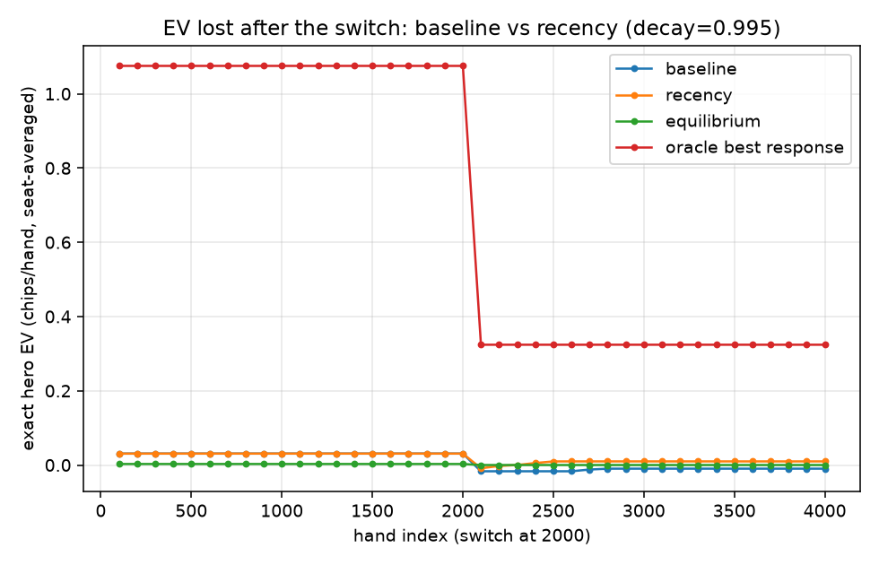

# PokerAlpha

**PokerAlpha is an imperfect-information game research platform studying when
an equilibrium agent should sacrifice robustness to exploit statistically
detected opponent behavior.**

A Nash equilibrium cannot be beaten in expectation — and against a flawed
opponent, that guarantee is exactly what stops you from winning more. This
project makes that tradeoff measurable: it solves poker games to equilibrium
with CFR/CFR+/MCCFR, infers an opponent's tendencies from public actions
alone, and then deviates from equilibrium by a controlled amount under an
explicit *exploitability budget* — the quantified cost of being wrong.

The interesting part is what constrains that deviation. Finite samples make
early reads unreliable, opponents change behavior mid-match, and both solving
and estimating are bounded by compute. Each of those is measured here rather
than assumed, including where the system **fails**.

| | |
| --- | --- |
| 📄 **Research writeup** | **[RESEARCH.md](RESEARCH.md)** — the full quantitative paper |
| ▶️ **Run the demo** | `python -m poker_alpha.demo` — the whole story in ~12s |
| 🔬 **Reproduce results** | [Reproducing the experiments](#reproducing-the-experiments) |
| 📊 **Raw data** | [`results/data/`](results/data) — every number is generated, none hand-entered |

## Selected measured results

| finding | measurement |
| --- | --- |
| A stationary Bayesian belief **fails permanently** under regime change; exponential forgetting repairs it | never recovers in 3/3 repeats vs **380–500 hands** at decay 0.995 — at the cost of 2× the false-switch rate |
| Profile-driven optimization of the 7-card hand evaluator | **11.0×** (37.7k → 415k evals/s), bit-identical results |
| Equity throughput, converting to precision under a fixed 10 ms budget | **7.9×** (17.1k → 135k sims/s) → ~171 → ~1,354 sims → **~2.8× tighter error bars** |
| The better *algorithm* depends on the compute budget | CFR beats CFR+ below ~0.5 s; they cross near **1 s**; CFR+ is 19× better by 20 s |
| Detectability and exploitability are nearly unrelated | deviation correlates with identification accuracy at r = 0.88, with exploitability at r = 0.28 (n = 5) |

## Quick start

```bash
python3 -m venv .venv
source .venv/bin/activate
python -m pip install -e ".[dev]"
pytest                        # 168 tests, ~45s
python -m poker_alpha.demo    # ~12s
```

The demo walks the full narrative in one deterministic run: equilibrium as a
baseline, live Bayesian opponent identification, the exploitation/robustness
tradeoff curve with the guardrail applied, the regime-change failure and its
fix, and the performance work. Every figure it prints is either computed live
or read from a committed CSV, and it says which.

## The research question

> **How much equilibrium robustness should an agent sacrifice to exploit
> statistically detected opponent behavior, under estimation error,
> distribution shift, and limited computation?**

The mapping to quantitative decision-making is deliberate: equilibrium is a
robust baseline, an opponent's behavioral deviation is exploitable structure,
finite observations are estimation error, deviating is taking model risk, and
exploitability is the quantified cost of being wrong. Poker is used because it
supplies something most applied settings cannot — an **exactly computable**
cost of being wrong. [RESEARCH.md §1](RESEARCH.md) states plainly where that
analogy breaks down.

*This is an offline research project. It does not connect to, automate, or
interact with any real poker platform, and makes no claim about profitability
in real-money poker or financial markets.*

## Key findings

1. **Equilibrium is robust but concedes structured EV.** Against a "maniac"
   opponent, equilibrium earns −9.0 chips/100 while an oracle best response
   earns +77.8 — at ~1,000× the exploitability. The opportunity is large and
   so is the risk of chasing it.
2. **The risk limit binds before statistical confidence does.** Under an
   ε = 0.1 exploitability budget the applied blend weight λ averages 0.059
   against a confidence-implied ceiling of 0.313.
3. **Estimation risk is real.** With only 20 hands of evidence, the worst
   draw against a calling station is −0.034 chips/hand unguarded and −0.020
   guarded — both worse than simply playing equilibrium.
4. **Stationary Bayesian inference fails outright under distribution shift.**
   After an unannounced archetype switch the posterior stays >0.99 confident
   at 96% of checkpoints while placing ~0 mass on the truth, and never
   recovers. Exponential forgetting fixes it, at a measured cost in false
   switches.
5. **Compute budgets change the right answer.** Both which solver to use and
   how precisely equity can be estimated are budget-dependent, and an 11×
   engineering win buys only a √-discounted improvement in decision quality.

Full derivations, tables, and caveats: **[RESEARCH.md](RESEARCH.md)**.

## Selected figures

| | |
| --- | --- |
|  |  |
| **Adaptation vs archetypes.** The oracle best response (orange) is an upper bound, not a realizable agent; the guarded adaptive agent (green) captures a bounded share of it. Error bars are wide — see limitations. | **Regime change.** The stationary belief (blue) never recovers after the opponent switches at hand 2,000; the recency-aware belief (orange) does, in 380–500 hands. |
|  |  |
| **Compute vs quality.** The solver curves cross near 1 s: CFR+ is asymptotically better but buys half the iterations, so it loses under a tight budget. | **Performance.** Four evaluator-dependent workloads improved 5–11×; the untouched workloads (0.93–1.07×) are the control that establishes the noise floor. |

## Limitations

Stated up front, because they bound every number above:

- **Opponent archetypes are synthetic** — multiplicative tilts of equilibrium,
  not empirical player types. The identifier also assumes the true opponent is
  well approximated by a mixture of its six known candidates.
- **Leduc is far smaller than real no-limit Hold'em** (288 information sets vs
  ~10¹⁶⁰ states). The Hold'em module here is an abstracted state engine, not a
  solved game.
- **Some realized-EV comparisons have wide confidence intervals** (~±17
  chips/100 at 3,000 hands); the exact-EV experiments, not the match results,
  are the load-bearing evidence.
- **decay = 0.995 is environment-specific**, conditional on the switch
  frequency and archetype set tested. No universal optimum is claimed.
- **No rake or transaction friction** appears in the central experiments.
- **This is not a real-money poker system or a trading strategy.**

The full limitations section is [RESEARCH.md §12](RESEARCH.md).

## What's implemented

- **Games** — Kuhn and Leduc poker as extensive-form games with chance nodes
  and information sets; an abstracted heads-up no-limit Hold'em state engine
  (100 BB, four streets, pot-relative sizing, chip-conservation checked).
- **Solvers** — vanilla CFR, CFR+ (regret clipping, alternating updates,
  linear averaging), external-sampling MCCFR, and exact evaluation: expected
  value, imperfect-information best response, exploitability.
- **Card engine** — 52-card integer representation, a hand evaluator covering
  all nine categories (verified against all 2,598,960 five-card hands), and a
  seeded Monte Carlo equity engine with weighted ranges and blocker handling.
- **Opponent modeling** — six archetypes, Beta-Bernoulli tendency posteriors,
  discrete Bayesian type inference from public actions only, exploitative best
  response, confidence-weighted λ blending, an exact exploitability guardrail,
  and a recency-aware belief for non-stationary opponents.
- **Risk** — return/downside metrics, max drawdown, VaR/CVaR, bootstrap
  confidence intervals, Kelly sizing, and bankroll/risk-of-ruin simulation.

## Detailed results

Everything below is measured, with the generating command given. For the
narrative version of these results — with the derivations, the statistical
caveats, and the full limitations — read **[RESEARCH.md](RESEARCH.md)**
instead; this section is the reference detail behind it.

### Kuhn poker: verification against known theory

`python experiments/kuhn_convergence.py --iterations 100000 --seed 42`

| quantity | measured | theory |
| --- | --- | --- |
| game value (player 0) | −0.055554 | −1/18 ≈ −0.055556 |
| exploitability after 100k iterations | 6.3 × 10⁻⁴ chips | → 0 at Nash |
| King facing bet: call | 100% | 100% (dominant) |
| Jack facing bet: fold | 100% | 100% (dominant) |
| Queen facing bet: call | 0.336 | 1/3 |


Solver comparison on Kuhn
(`python experiments/cfr_comparison.py --iterations 100000 --seed 42`),
measured on the same machine, exploitability in chips:

| algorithm | game | iterations | runtime | it/s | final exploitability |
| --- | --- | --- | --- | --- | --- |
| CFR | Kuhn | 100k | 27.9 s | 3,587 | 6.3 × 10⁻⁴ |
| CFR+ | Kuhn | 100k | 53.6 s | 1,865 | 2.1 × 10⁻⁶ |
| MCCFR (external sampling) | Kuhn | 100k | 12.3 s | 8,143 | 2.3 × 10⁻³ |

Two readings worth internalizing:

- **CFR+ converges near O(1/T)** versus CFR's O(1/√T) — ~300× lower
  exploitability here — at ~1.9× cost per iteration (an iteration is two
  alternating traversals, one per player).
- **MCCFR iterations are 2.3× cheaper than CFR's even on Kuhn**, but its
  sampled convergence is noisier, and on a ~50-node tree cheap iterations
  can't win: CFR+ dominates per unit wall-clock. Sampling pays off as the game
  grows — that scaling is what the Leduc experiment measures.


### Scaling up: Leduc Poker

Leduc (`python experiments/leduc_convergence.py --iterations 1000 --seed 42`)
is ~75× larger than Kuhn by decision nodes (3,780 vs ~50; 288 rank-merged
information sets). Measured results:

| algorithm | game | iterations | runtime | it/s | final exploitability |
| --- | --- | --- | --- | --- | --- |
| CFR | Leduc | 1k | 50.7 s | 19.7 | 1.6 × 10⁻² |
| CFR+ | Leduc | 1k | 92.2 s | 10.8 | 2.5 × 10⁻⁴ |
| MCCFR | Leduc | 200k | 106.0 s | 1,886 | 2.9 × 10⁻² |

- Full-traversal cost scaled with the tree: CFR went from 3,587 it/s on Kuhn
  to 19.7 it/s on Leduc (~180× slower per iteration), while MCCFR's sampled
  iterations only slowed ~4× (8,143 → 1,886 it/s). The *relative* cheapness of
  sampling grew from 2.3× to ~96×.
- CFR+ again dominates per iteration (~64× lower exploitability than CFR at
  1k) and converges to the known game value (measured −0.0855 vs −0.0856).
- **Honest negative result:** even at matched wall-clock, MCCFR still trails
  exact CFR on Leduc (4.7 × 10⁻² vs 1.6 × 10⁻² at ~50 s) — sampling variance
  dominates on a game that full traversal can still comfortably sweep. MCCFR's
  real payoff is games where a full traversal is infeasible *per se* (the
  abstracted Hold'em phase), not mid-sized games.


An implementation note worth knowing for interviews: CFR+'s regret clip must be
applied to an information set's **total** regret per iteration, not per visited
history. An information set spans several histories (in Kuhn, "hold the Jack"
spans two opponent cards), and clipping between visits biases the update — with
that bug, CFR+ degraded to CFR's O(1/√T) rate; buffering the per-iteration
deltas and clipping once restored O(1/T). The commit history preserves both
measurements.

### Opponent modeling: identification, adaptation, and its limits

The core research question — how much equilibrium robustness to trade for
opponent-specific exploitation — is tested directly on Leduc, where every
strategy's exact EV and exploitability are computable, not just estimated.
Four experiments (`experiments/adaptation_vs_archetypes.py`,
`opponent_identification.py`, `overfitting_vs_sample_size.py`,
`regime_change.py`; seed 42, 300-iteration CFR+ equilibrium):

**How fast can the opponent be identified?** A Bayesian posterior over the six
archetypes, updated hand-by-hand from public actions only (hero plays static
equilibrium; 50 repeats/archetype):

| archetype | correct by 5 hands | by 50 hands | by 100 hands |
| --- | --- | --- | --- |
| maniac | 78% | 96% | 100% |
| calling_station | 40% | 92% | 94% |
| bluff_heavy (subtlest tilt) | 18% | 72% | 84% |


**Does adaptation pay?** Three heroes, 3000-hand matches: static equilibrium,
an oracle best response (knows the true opponent strategy, uncapped — an EV
ceiling, not a realizable agent), and the online adaptive agent (posterior
mixture, refreshed every 20 hands, capped to an exploitability budget ε=0.1):

| opponent | equilibrium | oracle BR (exploitability) | adaptive (exploitability) |
| --- | --- | --- | --- |
| maniac | −9.0 | +77.8 (2.42) | +10.9 (≤0.10) |
| calling_station | −10.1 | +38.2 (1.82) | +3.1 (≤0.10) |
| bluff_heavy | −4.9 | +47.6 (2.60) | −1.7 (≤0.10) |

(chips/100 hands; oracle exploitability in chips, ~1000× the equilibrium's
own ~0.002.) The adaptive agent recovers a real slice of the oracle's edge at
a small, bounded exploitability cost — but at 3000 hands the bootstrap CIs on
these numbers are ~±17 chips/100, wide enough that most individual
adaptive-vs-equilibrium deltas above are not significant on their own.


Sweeping the exploitability budget ε against the maniac confirms the
*mechanism* works exactly as designed — mean applied λ rises monotonically
with ε (0 → 0.013 → 0.032 → 0.059 → 0.16 → 0.31 as ε: 0 → 1.0, matching the
uncapped ceiling computed directly from the posterior's deviation estimate) —
but a single 2000-hand run's realized EV at each ε is dominated by Leduc's
per-hand variance, not ε. Confirming the *EV* payoff of the tradeoff needs the
repeats/bootstrap approach above, not a one-shot sweep.

**Does the exploitability guardrail actually prevent overfitting to noise?**
Freezing a strategy after only *n* hands of belief formation and scoring its
*exact* EV (`profile_value`, no evaluation noise; 15 repeats/point) shows the
posterior's own confidence gating already blocks most early overfitting — at
5–20 hands, low confidence caps λ regardless of the guardrail, so guarded and
unguarded strategies both stay near equilibrium. Once confidence saturates
(60+ hands), the guardrail's effect is visible: against maniac at 1000 hands,
guarded settles at 0.031 chips/hand vs unguarded's 0.184 (oracle 1.075) — most
of the unguarded edge traded away for a much smaller exploitability
footprint. In worst-case draws the guardrail bounds tail losses when it binds
(calling_station @ 20 hands: guarded_min −0.020 vs unguarded_min −0.034) and
is a no-op, not a floor, when it doesn't.

**Honest negative result: regime change.** The opponent plays maniac for 2000
hands, then switches to nit for 2000 more, with no signal to the hero. The
posterior locks onto maniac early in the first regime — then, after the
switch, it stays *confidently wrong*: the MAP estimate is never correct at
any post-switch checkpoint, and posterior mass on the true new archetype
stays numerically ~0 (below 1e-319) across the entire remaining 2000 hands,
in all 3 repeats. `ArchetypeBelief` accumulates log-likelihood over every hand it has
ever seen with no decay: a sound assumption for a stationary opponent, and
actively harmful for a non-stationary one — once confidence saturates, old
evidence permanently outvotes new evidence forever.

### Fixing it: a recency-aware belief, and what it costs

`ArchetypeBelief` now takes a `decay` parameter: exponential forgetting of the
accumulated log-likelihood (`LL_t = decay·LL_{t-1} + ll_t`, effective memory
horizon ≈ 1/(1−decay) hands). `decay=1.0` is the exact stationary baseline
above — unchanged, still the default, every existing call site and test
untouched. This is not a free upgrade: forgetting old evidence also means a
decaying belief has less protection against noise, so it can *misidentify a
stationary opponent* just from an unlucky run of hands. `regime_change.py`
now measures both sides on the identical maniac→nit switch (baseline and
`decay=0.995` fed the exact same paired hand sequence) and on a
stationary-opponent control (no switch at all, 30 repeats, decay swept from
1.0 to 0.98):

| | baseline (decay=1.0) | recency (decay=0.995) |
| --- | --- | --- |
| detection delay (hands post-switch to a *sustained* correct MAP estimate) | never, in 3/3 repeats | 380–500, in 3/3 repeats |
| confidence during recovery | >0.99 at 96% of post-switch checkpoints, never below 0.87 — *confidently* wrong | falls to 0.76, then re-saturates |
| false-switch rate, stationary maniac (30 reps, post-warmup) | 0.02% | 0.0% |
| false-switch rate, stationary bluff_heavy (30 reps, post-warmup) | 0.71% | 1.39% |


decay=0.995 is a good point on the curve, not a free lunch: sweeping decay
down to 0.98 on the stationary control shows *why* it isn't pushed lower —
false switches on bluff_heavy (the hardest archetype to read) jump to 10.8%
of checkpoints (8.6 flip episodes per 3000-hand repeat), trading faster
hypothetical recovery for materially worse stability against an opponent that
never actually changed.


Under this experiment's ε=0.1 exploitability guardrail (from the adaptation
experiment above), the exact EV (`profile_value`) of both baseline's and
recency's frozen strategy tracks close to equilibrium — well short of the
oracle ceiling either way — so the guardrail itself absorbs most of the
downside of misidentification at this budget; a looser ε would make getting
the identification right (or wrong) matter more.



## The math (no CFR background assumed)

**Extensive-form games & information sets.** Poker is a sequential game where
players cannot see each other's cards. All game states that look identical to
the acting player (same own cards, same public history) form an *information
set*; a strategy must choose the same action distribution everywhere inside one
— that is what "not seeing the opponent's cards" means formally.

**Regret.** After playing, compare what you earned with what you *would* have
earned by always picking some action `a` at an information set. That difference
is the regret for `a`. *Counterfactual* regret weights this by the probability
that the other players and chance even let you reach that information set.

**Regret matching.** Next iteration, play each action with probability
proportional to its accumulated *positive* regret:

```
σ(a) = max(R(a), 0) / Σ_b max(R(b), 0)      (uniform if all regrets ≤ 0)
```

**Why CFR converges.** Regret matching guarantees average regret grows like
O(√T), so average regret per iteration → 0. In two-player zero-sum games, a
profile in which neither player has positive average regret is a Nash
equilibrium — and the guarantee applies to the **time-averaged** strategy, which
is why the solver tracks cumulative strategy sums and reports the average (the
current iterate oscillates; the average converges).

**Exploitability** measures the distance from equilibrium: how much a
best-responding adversary could win against your strategy, averaged over both
seats. Zero exactly at Nash. Our best response respects information sets (it
does not peek at hidden cards), computed by resolving information sets
deepest-first with counterfactual reach weights.

## Performance engineering

Profile first, optimize second, prove correctness unchanged, then re-measure.
All numbers below come from `experiments/performance_benchmark.py` (7 timed
repetitions after a warmup, `time.perf_counter`) and live in
`results/data/performance_comparison.csv`.

### What profiling identified

`cProfile` on 20,000 preflop equity simulations put **94.6% of runtime inside
`evaluate_best`**. The cause was algorithmic, not micro: evaluating seven
cards by taking `max` over every five-card subset costs C(7,5) = 21
`evaluate_five` calls, so one simulated hand (hero + villain) ran 42 of them —
840,000 calls for the 20k-simulation workload. Monte Carlo sampling, the
part that *looks* expensive, was negligible by comparison.

### What was optimized

1. **Direct 7-card evaluation.** `evaluate_best` now derives the hand
   directly from rank/suit histograms and a 13-bit rank mask, testing
   categories in descending order and returning on the first match. Straights
   use the bit trick `m = r & r>>1 & r>>2 & r>>3 & r>>4`, whose highest set
   bit is the straight's low card. This removes the 21× subset blowup
   entirely: 21 evaluations → 1.
2. **A pre-validated fast path.** With the evaluator fast, re-profiling
   showed `codes()` — the mixed-type (`Card` / `int` / `"As"`) normalizer —
   had risen to ~24% of equity runtime, doing 560k `isinstance` checks on
   values the sampler already produced as integers. `evaluate_best_codes`
   skips that normalization; `estimate_equity` calls it directly.

### Measured before/after

| workload | before | after | speedup |
| --- | --- | --- | --- |
| hand_eval_7card | 37,679 evals/s | 414,955 evals/s | **11.01×** |
| equity_flop_uniform | 17,108 sims/s | 135,370 sims/s | **7.91×** |
| equity_preflop_uniform | 17,874 sims/s | 126,444 sims/s | **7.07×** |
| equity_weighted_range | 15,068 sims/s | 74,764 sims/s | **4.96×** |
| hand_eval_5card | 831,594 evals/s | 810,468 evals/s | 0.97× |
| cfr_leduc / cfr_plus_leduc / mccfr_leduc | — | — | 1.02× / 1.02× / 1.01× |
| exploitability_leduc / profile_value_leduc | — | — | 0.96× / 0.95× |
| belief_update / leduc_match_simulation | — | — | 0.96× / 0.93× |


### What did *not* improve, and why

The solver, exact-evaluation and opponent-modeling workloads are untouched:
none of them import the hand evaluator (Leduc compares ranks directly), so
they act as a **built-in control**. Their spread — 0.93× to 1.07× — is the
honest noise floor of this machine, and it is the reason no speedup below
roughly 1.1× anywhere in the table should be read as real. `hand_eval_5card`
is deliberately flat: `evaluate_five` was left exactly as it was, since it is
the reference semantics the fast path is verified against and it was never
the bottleneck.

`equity_weighted_range` gains least (4.96×) because a weighted range spends a
second `rng.choice` per simulation to draw the villain combo; with evaluation
no longer dominant, that NumPy call is a larger share of what remains. The
next optimization there would be batching the RNG draws — deliberately *not*
done, because it would change the per-seed random stream and therefore the
reproducibility contract below.

### Tradeoffs introduced

* `evaluate_best_codes` trades a little safety for speed: it skips input
  validation, so it is documented as a fast path for callers that already
  hold validated integer codes. `evaluate_best` remains the safe public entry
  point and is unchanged in behavior.
* The direct evaluator is denser code than a 21-way `max`. It is paid for by
  the equivalence tests, not by trust.
* No new dependency was added. `numba` remains an optional extra and is still
  unused; a ~11× algorithmic win made a JIT unnecessary.

### Correctness: the optimization is provably behavior-preserving

Speed gains do not count if results move. This one was pinned before and
after:

* **Exhaustive**: all **2,598,960** distinct five-card hands agree with
  `evaluate_five` exactly, and the category histogram reproduces the textbook
  frequencies (40 straight flushes, 624 quads, …, 1,302,540 high card).
* **Random**: 300,000 seven-card and 60,000 six-card hands agree with the
  original subset-max implementation — zero mismatches.
* **Adversarial**: two trips, three pairs, quads-plus-trips, steel wheel
  under a bigger flush, six- and seven-card flushes — the cases a direct
  evaluator typically gets wrong. All committed as tests.
* **End-to-end**: SHA-256 digests of hand-value streams, exact
  `estimate_equity` floats for identical seeds, and CFR/CFR+ average-strategy
  digests are **bit-identical** before and after. Because only the evaluation
  path changed and the RNG draw sequence was left alone, every seeded result
  in this repository still reproduces exactly.

### Complexity, measured rather than asserted

| component | cost | measured behavior |
| --- | --- | --- |
| Full-tree CFR / CFR+ iteration | O(\|tree\|) per traversal | Kuhn ~50 nodes → 8.4k it/s; Leduc 3,780 → 46 it/s, ~180× slower for a ~75× bigger tree |
| MCCFR iteration | O(depth) per sampled path | barely grows with tree size: 22.2k it/s Kuhn → 5.1k it/s Leduc (~4×), which is why sampling wins as games grow |
| Exact best response / exploitability | two full traversals + per-infoset argmax | 19 calls/s on Leduc — the reason the λ-guardrail bisection is the costliest part of the adaptive agent |
| Hand evaluation (7 cards) | was O(C(7,5)) = 21 sub-evaluations; now O(1) histogram | 37.7k → 415k evals/s |
| Monte Carlo equity | O(simulations) evaluations; error O(1/√n) | 17.1k → 135k sims/s, so a fixed latency now buys ~7× the samples and ~√7 ≈ 2.6× tighter error |

The memory-vs-compute tradeoff was considered and **rejected**: a full
precomputed 7-card lookup table would make evaluation a single array index,
but C(52,7) = 133,784,560 entries is hundreds of MB and would need building
or shipping. The histogram evaluator gets most of the win with zero
preprocessing and no memory footprint — the right point on that curve for a
research codebase.

### Compute budget vs decision quality

A decision system rarely runs to convergence — it gets a budget.
`experiments/compute_quality_tradeoff.py` trains each solver in chunks until a
wall-clock budget is spent (evaluation clock stopped, so measuring never eats
the budget) and scores the result by exploitability. This is an
imperfect-information-game analogue of a latency budget, not a production
trading benchmark.

The headline finding is that **the best algorithm depends on the budget**:

| budget | CFR | CFR+ | MCCFR | best |
| --- | --- | --- | --- | --- |
| 0.05 s | 0.972 | 2.058 | 1.320 | CFR |
| 0.25 s | 0.279 | 1.011 | 0.637 | CFR (3.6× better than CFR+) |
| 0.5 s | 0.182 | 0.358 | 0.390 | CFR |
| 1 s | 0.105 | 0.096 | 0.226 | CFR+ (crossover) |
| 5 s | 0.034 | 0.0095 | 0.082 | CFR+ |
| 20 s | 0.0176 | 0.00093 | 0.045 | CFR+ (19× better than CFR) |

(exploitability in chips; lower is better)


Below about half a second, plain CFR wins: CFR+ spends two alternating
traversals per iteration, so it buys roughly half the iterations, and its
regret clipping and linear averaging need enough iterations before their
asymptotically better rate pays off. Past the ~1 s crossover the asymptotics
take over and CFR+'s advantage compounds to 19× by 20 s. MCCFR trails at every
budget on a game this small — the same honest negative already documented for
Leduc: sampled iterations are only worth their variance when a full traversal
is infeasible.

The equity engine shows the other half of the tradeoff. Monte Carlo error
falls as 1/√n, so accuracy is bought at quadratic cost — and measured RMS
error over 12 seeds tracks that law closely:

| latency | simulations | RMS error |
| --- | --- | --- |
| 7.9 ms | 1,000 | 1.62 × 10⁻² |
| 78 ms | 10,000 | 3.39 × 10⁻³ |
| 2.3 s | 300,000 | 7.9 × 10⁻⁴ |


This is where the optimization cashes out in decision quality rather than
vanity throughput: at a fixed 10 ms budget the old evaluator afforded ~171
simulations, the new one ~1,354 — and since error scales as 1/√n, that is
**≈2.8× tighter error bars for the same latency**.

## Reproducing the experiments

Every number in this README and in [RESEARCH.md](RESEARCH.md) comes from a
committed CSV in `results/data/`, produced by a seeded script in
`experiments/`. Nothing is hand-entered.

**Fast** (seconds):

```bash
python -m poker_alpha.demo                                  # ~12s
pytest                                                      # 168 tests, ~45s
```

**Moderate** (under a minute each):

```bash
python experiments/opponent_identification.py --repeats 50 --seed 42
python experiments/kuhn_convergence.py --iterations 100000 --seed 42
python experiments/regime_change.py --seed 42
```

**Expensive** (several minutes each — these do the heavy solving):

```bash
python experiments/cfr_comparison.py --iterations 100000 --seed 42
python experiments/leduc_convergence.py --iterations 1000 --seed 42
python experiments/adaptation_vs_archetypes.py --hands 3000 --seed 42
python experiments/overfitting_vs_sample_size.py --repeats 15 --seed 42
python experiments/compute_quality_tradeoff.py --seed 42
```

**Benchmarks** — timing is machine-dependent, so the before/after arms must be
run back-to-back on an idle machine (the untouched control workloads should
land within ~±7%, otherwise the comparison is measuring noise):

```bash
python experiments/performance_benchmark.py --label baseline
python experiments/performance_benchmark.py --label optimized
python experiments/performance_benchmark.py --compare baseline optimized
```

All scripts accept `--seed` and `--outdir`, and most accept `--iterations` or
`--hands`; they write raw CSVs to `results/data/` and figures to
`results/figures/`.

## Repository structure

```
poker_alpha/
  games/        extensive-form games: Game interface, Kuhn, Leduc,
                abstracted heads-up no-limit Hold'em
  solvers/      CFR, CFR+, external-sampling MCCFR, and exact evaluation
                (expected value, best response, exploitability)
  poker/        52-card engine, hand evaluator, Monte Carlo equity
  opponent/     archetypes, Beta-Bernoulli and discrete Bayesian models,
                match simulation, risk-constrained adaptive exploitation
  risk/         return/drawdown metrics, Kelly sizing, bankroll simulation
  utils/        seeding, plotting, shared experiment harness
  demo.py       the narrative demo (python -m poker_alpha.demo)
experiments/      runnable, seeded, parameterized experiment scripts
results/
  data/           generated CSVs — the source of every number quoted
  figures/        generated figures
tests/            pytest suite (168 tests)
RESEARCH.md       the full research writeup
TODO.md           development history, phase by phase
```

## Design principles

- Solvers depend only on a minimal `Game` interface, so one CFR implementation
  trains on every game in the project.
- Math is kept visible: `regret_matching(regrets: np.ndarray)` is a function,
  not a framework.
- All reported numbers come from actual runs; nothing in this README or
  RESEARCH.md is hand-entered.
- Results carry uncertainty wherever sampling is involved — bootstrap
  confidence intervals on match results, and exact computation preferred over
  simulation wherever the game is small enough to allow it.
- Negative results are reported, not buried. The regime-change failure and the
  MCCFR non-result are both load-bearing parts of the writeup.

## License

MIT
