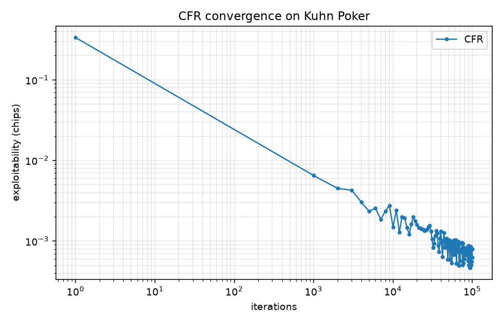
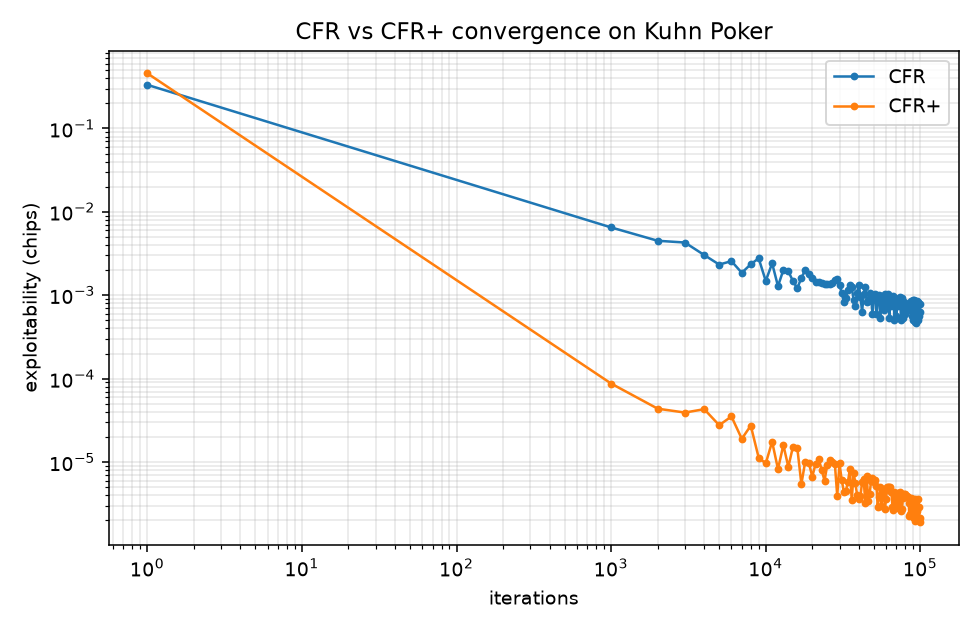
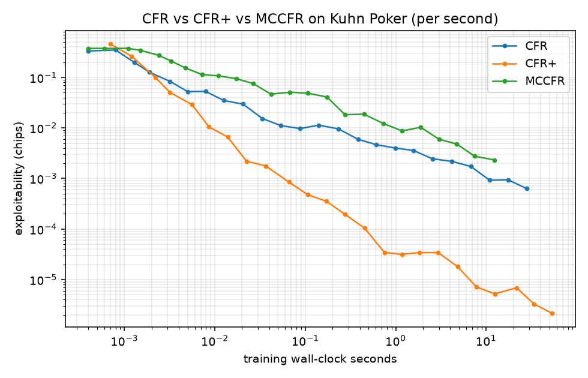
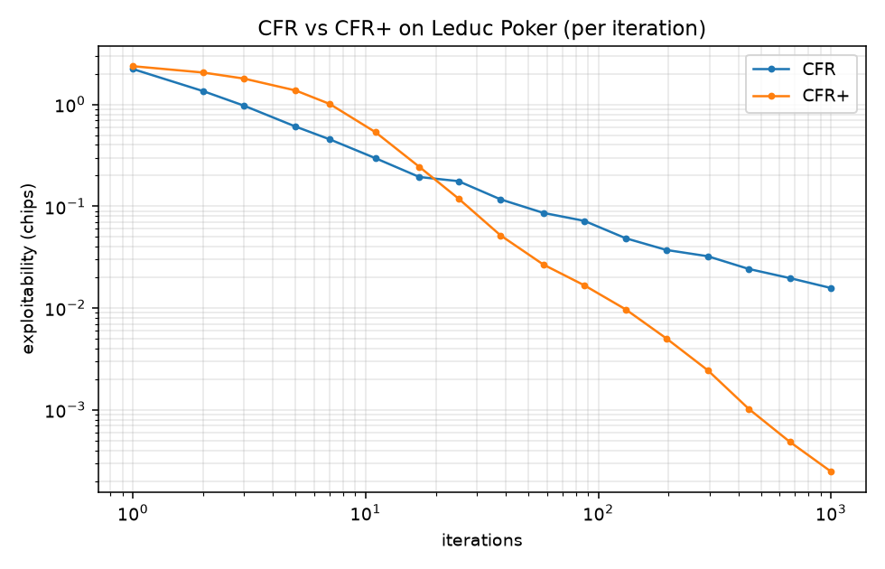
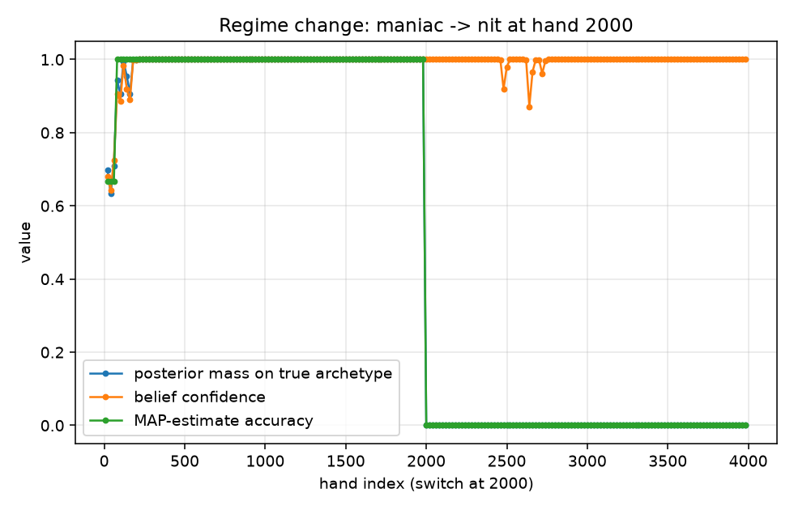

# PokerAlpha

Game-theoretic poker solver and adaptive exploitation engine — a quantitative
research project studying the tradeoff between **equilibrium robustness** and
**opponent-specific exploitation** in imperfect-information games.

> **Core research question:** How much equilibrium robustness should a poker
> agent sacrifice in order to exploit statistically detected weaknesses in an
> opponent?

This is an offline simulation and research project. It does not connect to,
automate, or interact with any real poker platform.

## Status

Phases 1–15 of the [development plan](TODO.md) are complete and verified
(132 tests):

- **Kuhn Poker** implemented as an extensive-form game (states, chance nodes,
  information sets, utilities).
- **Leduc Poker** — public card, two betting rounds with raises and a raise
  cap, pot-based fold/showdown utilities; converges to the known game value.
- **Vanilla CFR** with regret matching, cumulative/average strategies.
- **CFR+** with regret clipping, alternating updates, and linear averaging.
- **External-sampling MCCFR** with seeded, deterministic sampling.
- **Exploitability evaluation** via a true imperfect-information best response.
- **Convergence experiments** with reproducible results.
- **Card engine + hand evaluator** — 52-card integer representation, all nine
  hand categories as lexicographically comparable tuples (wheel included),
  best-of-seven; 25 tests.
- **Monte Carlo equity engine** — seeded showdown-equity estimation against
  uniform or weighted opponent ranges with blocker handling. Validated against
  known values: AA vs random 85.1% (reference 85.2%), 72o 34.1% (≈34.6%).
- **Abstracted heads-up NL Hold'em** — 100 BB stacks, four streets, pot-relative
  sizing, sampled chance, chip-conservation-checked random playouts.
- **Opponent modeling** — six archetypes as multiplicative tilts of the
  equilibrium; Bayesian identification from public actions only; a
  risk-constrained adaptive strategy (confidence-weighted λ blend, exact
  exploitability guardrail). See
  [Opponent modeling: identification, adaptation, and its limits](#opponent-modeling-identification-adaptation-and-its-limits)
  below for measured results, including an honest negative one.
- **Risk analytics** — return metrics with bootstrap CIs, Kelly criterion,
  bankroll / risk-of-ruin simulation.

Current measured results (`python experiments/kuhn_convergence.py --iterations 100000 --seed 42`):

| quantity | measured | theory |
| --- | --- | --- |
| game value (player 0) | −0.055554 | −1/18 ≈ −0.055556 |
| exploitability after 100k iterations | 6.3 × 10⁻⁴ chips | → 0 at Nash |
| King facing bet: call | 100% | 100% (dominant) |
| Jack facing bet: fold | 100% | 100% (dominant) |
| Queen facing bet: call | 0.336 | 1/3 |



Solver comparison on Kuhn
(`python experiments/cfr_comparison.py --iterations 100000 --seed 42`),
measured on the same machine, exploitability in chips:

| algorithm | game | iterations | runtime | it/s | final exploitability |
| --- | --- | --- | --- | --- | --- |
| CFR | Kuhn | 100k | 27.9 s | 3,587 | 6.3 × 10⁻⁴ |
| CFR+ | Kuhn | 100k | 53.6 s | 1,865 | 2.1 × 10⁻⁶ |
| MCCFR (external sampling) | Kuhn | 100k | 12.3 s | 8,143 | 2.3 × 10⁻³ |

Two readings worth internalizing:

- **CFR+ converges near O(1/T)** versus CFR's O(1/√T) — ~300× lower
  exploitability here — at ~1.9× cost per iteration (an iteration is two
  alternating traversals, one per player).
- **MCCFR iterations are 2.3× cheaper than CFR's even on Kuhn**, but its
  sampled convergence is noisier, and on a ~50-node tree cheap iterations
  can't win: CFR+ dominates per unit wall-clock. Sampling pays off as the game
  grows — that scaling is what the Leduc experiment measures.




### Scaling up: Leduc Poker

Leduc (`python experiments/leduc_convergence.py --iterations 1000 --seed 42`)
is ~75× larger than Kuhn by decision nodes (3,780 vs ~50; 288 rank-merged
information sets). Measured results:

| algorithm | game | iterations | runtime | it/s | final exploitability |
| --- | --- | --- | --- | --- | --- |
| CFR | Leduc | 1k | 50.7 s | 19.7 | 1.6 × 10⁻² |
| CFR+ | Leduc | 1k | 92.2 s | 10.8 | 2.5 × 10⁻⁴ |
| MCCFR | Leduc | 200k | 106.0 s | 1,886 | 2.9 × 10⁻² |

- Full-traversal cost scaled with the tree: CFR went from 3,587 it/s on Kuhn
  to 19.7 it/s on Leduc (~180× slower per iteration), while MCCFR's sampled
  iterations only slowed ~4× (8,143 → 1,886 it/s). The *relative* cheapness of
  sampling grew from 2.3× to ~96×.
- CFR+ again dominates per iteration (~64× lower exploitability than CFR at
  1k) and converges to the known game value (measured −0.0855 vs −0.0856).
- **Honest negative result:** even at matched wall-clock, MCCFR still trails
  exact CFR on Leduc (4.7 × 10⁻² vs 1.6 × 10⁻² at ~50 s) — sampling variance
  dominates on a game that full traversal can still comfortably sweep. MCCFR's
  real payoff is games where a full traversal is infeasible *per se* (the
  abstracted Hold'em phase), not mid-sized games.



An implementation note worth knowing for interviews: CFR+'s regret clip must be
applied to an information set's **total** regret per iteration, not per visited
history. An information set spans several histories (in Kuhn, "hold the Jack"
spans two opponent cards), and clipping between visits biases the update — with
that bug, CFR+ degraded to CFR's O(1/√T) rate; buffering the per-iteration
deltas and clipping once restored O(1/T). The commit history preserves both
measurements.

### Opponent modeling: identification, adaptation, and its limits

The core research question — how much equilibrium robustness to trade for
opponent-specific exploitation — is tested directly on Leduc, where every
strategy's exact EV and exploitability are computable, not just estimated.
Four experiments (`experiments/adaptation_vs_archetypes.py`,
`opponent_identification.py`, `overfitting_vs_sample_size.py`,
`regime_change.py`; seed 42, 300-iteration CFR+ equilibrium):

**How fast can the opponent be identified?** A Bayesian posterior over the six
archetypes, updated hand-by-hand from public actions only (hero plays static
equilibrium; 50 repeats/archetype):

| archetype | correct by 5 hands | by 50 hands | by 100 hands |
| --- | --- | --- | --- |
| maniac | 78% | 96% | 100% |
| calling_station | 40% | 92% | 94% |
| bluff_heavy (subtlest tilt) | 18% | 72% | 84% |


**Does adaptation pay?** Three heroes, 3000-hand matches: static equilibrium,
an oracle best response (knows the true opponent strategy, uncapped — an EV
ceiling, not a realizable agent), and the online adaptive agent (posterior
mixture, refreshed every 20 hands, capped to an exploitability budget ε=0.1):

| opponent | equilibrium | oracle BR (exploitability) | adaptive (exploitability) |
| --- | --- | --- | --- |
| maniac | −9.0 | +77.8 (2.42) | +10.9 (≤0.10) |
| calling_station | −10.1 | +38.2 (1.82) | +3.1 (≤0.10) |
| bluff_heavy | −4.9 | +47.6 (2.60) | −1.7 (≤0.10) |

(chips/100 hands; oracle exploitability in chips, ~1000× the equilibrium's
own ~0.002.) The adaptive agent recovers a real slice of the oracle's edge at
a small, bounded exploitability cost — but at 3000 hands the bootstrap CIs on
these numbers are ~±17 chips/100, wide enough that most individual
adaptive-vs-equilibrium deltas above are not significant on their own.


Sweeping the exploitability budget ε against the maniac confirms the
*mechanism* works exactly as designed — mean applied λ rises monotonically
with ε (0 → 0.013 → 0.032 → 0.059 → 0.16 → 0.31 as ε: 0 → 1.0, matching the
uncapped ceiling computed directly from the posterior's deviation estimate) —
but a single 2000-hand run's realized EV at each ε is dominated by Leduc's
per-hand variance, not ε. Confirming the *EV* payoff of the tradeoff needs the
repeats/bootstrap approach above, not a one-shot sweep.

**Does the exploitability guardrail actually prevent overfitting to noise?**
Freezing a strategy after only *n* hands of belief formation and scoring its
*exact* EV (`profile_value`, no evaluation noise; 15 repeats/point) shows the
posterior's own confidence gating already blocks most early overfitting — at
5–20 hands, low confidence caps λ regardless of the guardrail, so guarded and
unguarded strategies both stay near equilibrium. Once confidence saturates
(60+ hands), the guardrail's effect is visible: against maniac at 1000 hands,
guarded settles at 0.031 chips/hand vs unguarded's 0.184 (oracle 1.075) — most
of the unguarded edge traded away for a much smaller exploitability
footprint. In worst-case draws the guardrail bounds tail losses when it binds
(calling_station @ 20 hands: guarded_min −0.020 vs unguarded_min −0.034) and
is a no-op, not a floor, when it doesn't.

**Honest negative result: regime change.** The opponent plays maniac for 2000
hands, then switches to nit for 2000 more, with no signal to the hero. The
posterior correctly locks onto maniac by ~180 hands — then, after the switch,
confidence stays pegged at ~1.0 *on the now-wrong label*, and posterior mass
on the true new archetype measures numerically ~0 for the entire remaining
1980 post-switch hands, in all 3 repeats (reaching only ~1e-280 by hand
3980). `ArchetypeBelief` accumulates log-likelihood over every hand it has
ever seen with no decay: a sound assumption for a stationary opponent, and
actively harmful for a non-stationary one — once confidence saturates, old
evidence permanently outvotes new evidence. Documented as a limitation rather
than patched speculatively; see [TODO.md](TODO.md) for the scoped fix
(a recency-windowed or exponentially-discounted posterior).



Upcoming (see [TODO.md](TODO.md)): a windowed/discounted belief for
non-stationary opponents, exploration-vs-exploitation and rake-sensitivity
experiments, performance profiling, and a final RESEARCH.md writeup.

## The math so far (no CFR background assumed)

**Extensive-form games & information sets.** Poker is a sequential game where
players cannot see each other's cards. All game states that look identical to
the acting player (same own cards, same public history) form an *information
set*; a strategy must choose the same action distribution everywhere inside one
— that is what "not seeing the opponent's cards" means formally.

**Regret.** After playing, compare what you earned with what you *would* have
earned by always picking some action `a` at an information set. That difference
is the regret for `a`. *Counterfactual* regret weights this by the probability
that the other players and chance even let you reach that information set.

**Regret matching.** Next iteration, play each action with probability
proportional to its accumulated *positive* regret:

```
σ(a) = max(R(a), 0) / Σ_b max(R(b), 0)      (uniform if all regrets ≤ 0)
```

**Why CFR converges.** Regret matching guarantees average regret grows like
O(√T), so average regret per iteration → 0. In two-player zero-sum games, a
profile in which neither player has positive average regret is a Nash
equilibrium — and the guarantee applies to the **time-averaged** strategy, which
is why the solver tracks cumulative strategy sums and reports the average (the
current iterate oscillates; the average converges).

**Exploitability** measures the distance from equilibrium: how much a
best-responding adversary could win against your strategy, averaged over both
seats. Zero exactly at Nash. Our best response respects information sets (it
does not peek at hidden cards), computed by resolving information sets
deepest-first with counterfactual reach weights.

## Running

```bash
pip install -e ".[dev]"     # or: pip install -r requirements.txt
pytest                       # 132 tests
python experiments/kuhn_convergence.py --iterations 100000 --seed 42
python experiments/adaptation_vs_archetypes.py --seed 42
python experiments/opponent_identification.py --seed 42
python experiments/overfitting_vs_sample_size.py --seed 42
python experiments/regime_change.py --seed 42
```

Experiments take command-line arguments (`--iterations`/`--hands`, `--seed`,
`--outdir`) and write raw CSV data to `results/data/` and figures to
`results/figures/`. All randomness is seeded for reproducibility.

## Repository structure

```
poker_alpha/
  games/      extensive-form game definitions (base interface, Kuhn; Leduc & Hold'em later)
  solvers/    CFR (+ CFR+/MCCFR later) and strategy evaluation (EV, best response, exploitability)
  poker/      card engine, hand evaluator, equity simulation (later phases)
  opponent/   archetypes, statistics, Bayesian modeling, exploitation (later phases)
  risk/       bankroll, Kelly, risk metrics (later phases)
  utils/      seeding, plotting
experiments/  runnable, parameterized experiments
tests/        pytest suite
results/      generated data and figures (never hand-entered)
```

## Design principles

- Solvers depend only on a minimal `Game` interface, so one CFR implementation
  trains on every game in the project.
- Math is kept visible: `regret_matching(regrets: np.ndarray)` is a function,
  not a framework.
- All reported numbers come from actual runs; nothing in this README or the
  research notes is hand-entered.
- Results carry uncertainty wherever sampling is involved (later phases add
  bootstrap confidence intervals for match results).

## License

MIT
