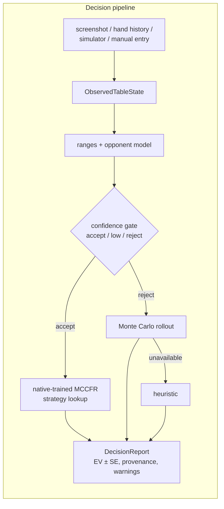
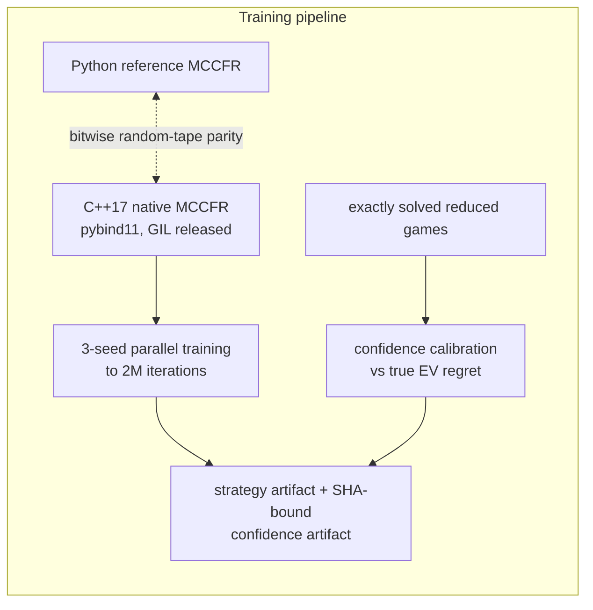
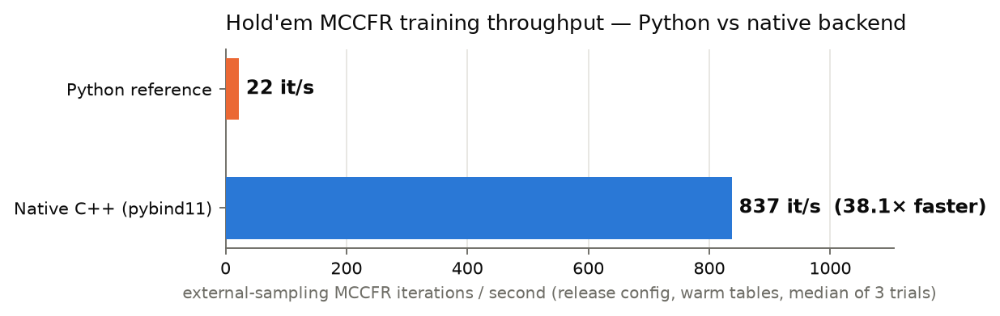
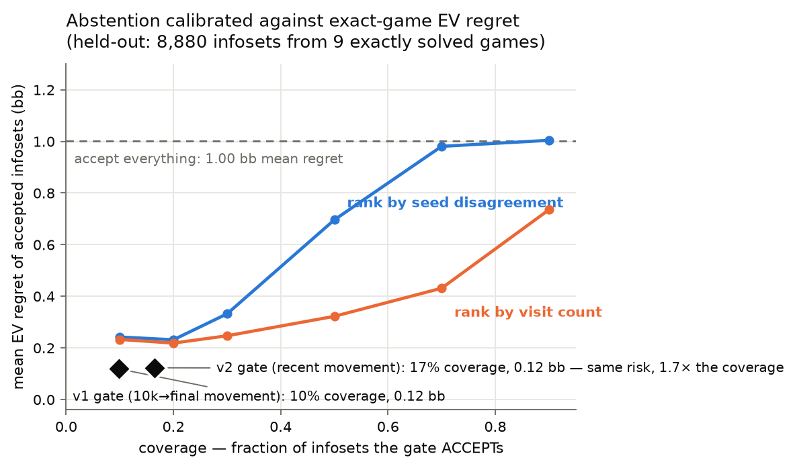
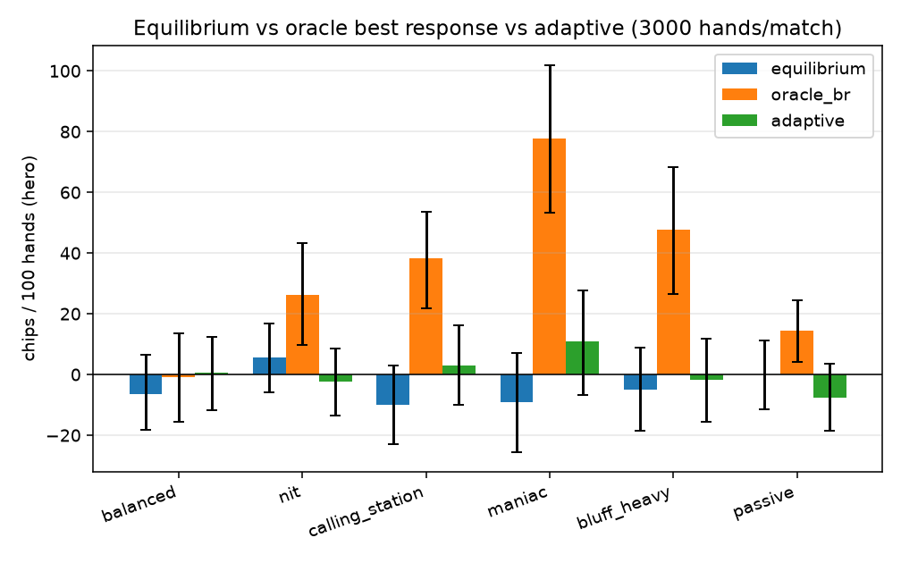
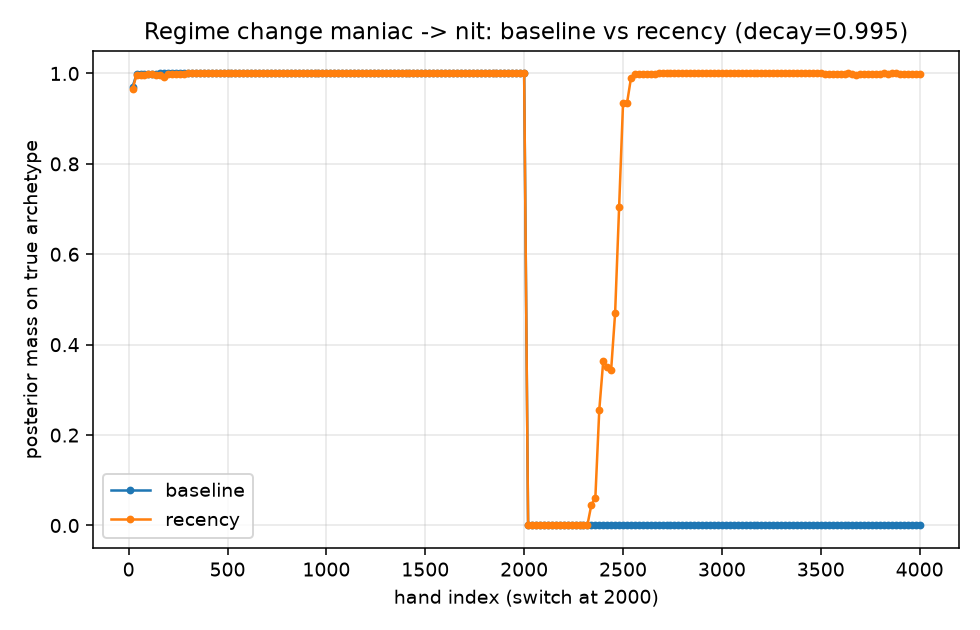

# PokerAlpha

[](https://github.com/codyrchen/poker-alpha/actions/workflows/tests.yml)


**A high-performance research platform for imperfect-information
decision-making, centered on heads-up no-limit Hold'em.**

PokerAlpha solves imperfect-information games with CFR / CFR+ /
external-sampling MCCFR, validates every solver against exactly solvable
reduced games, trains large abstract Hold'em strategies on a C++17 native
backend that is a measured **38× faster** than the Python reference (proven
bitwise-equivalent), and — the part most systems skip — **quantifies when
its own strategy should not be trusted**: a confidence/abstention layer
calibrated against exact-game EV regret decides per decision whether to use
the solver, fall back, or abstain. Every number below traces to a committed
result file; the limitations are measured, not disclaimed.

## At a glance

| Result | Measured outcome |
| --- | --- |
| Native MCCFR backend | **38.1× warm speedup** (837 vs 22 it/s, median of 3 trials) — [benchmark](docs/native_solver_benchmark.md) |
| Cross-language correctness | Python and C++ solvers **bitwise identical** over 1,000 training iterations on a shared random tape |
| Hand evaluator | exact parity on **all 2,598,960** five-card hands + 1M random 7-card hands |
| Exact-game validation | native MCCFR run directly on **7 exactly solved games**: exploitability ratio vs Python 1.04; both → ~0 — [report](docs/native_direct_exact_validation.md) |
| Training scale | 3 independent seeds × **2,000,000 iterations** (~50 min wall on a laptop), exact checkpoint resume |
| Confidence calibration | abstention rule calibrated on **8,880 infosets with exact EV-regret targets**; v2 gives **1.7× the coverage at equal accepted risk**, held-out — [methodology](docs/solver_confidence_v2.md) |
| Honest exploitability floor | validated restricted-LBR lower bound: every strategy in this family is still **≥ ~100 bb/100** exploitable in the full game — stated, not hidden |
| Tests / CI | 835 tests; GitHub Actions on Linux + macOS arm64, including native C++ build + parity jobs |

## Architecture


```mermaid
flowchart LR
  subgraph Decision pipeline
    A[screenshot / hand history /<br/>simulator / manual entry] --> B[ObservedTableState]
    B --> C[ranges + opponent model]
    C --> D{confidence gate<br/>accept / low / reject}
    D -- accept --> E[native-trained MCCFR<br/>strategy lookup]
    D -- reject --> F[Monte Carlo rollout]
    F -- unavailable --> G[heuristic]
    E --> H[DecisionReport<br/>EV ± SE, provenance, warnings]
    F --> H
    G --> H
  end
```


```mermaid
flowchart LR
  subgraph Training pipeline
    P[Python reference MCCFR] <-. bitwise random-tape parity .-> N[C++17 native MCCFR<br/>pybind11, GIL released]
    N --> M[3-seed parallel training<br/>to 2M iterations]
    M --> S[strategy artifact + SHA-bound<br/>confidence artifact]
    X[exactly solved reduced games] --> K[confidence calibration<br/>vs true EV regret]
    K --> S
  end
```

The observer input is **read-only** (pixels in, nothing out — no clicking,
no automation); details under [Safety](#safety--intended-use).

## Why this is hard

- **Imperfect information**: strategies must be fixed per *information set*,
  and equilibrium play requires mixing — there is no single "correct move"
  to supervise against.
- **Scale**: heads-up no-limit Hold'em has ~10¹⁶⁰ states; everything runs
  through an abstraction whose error must itself be measured.
- **Imperfect recall**: the tractable abstraction deliberately forgets
  history, which voids CFR's equilibrium guarantee — so correctness
  evidence has to come from exactly solvable reduced games instead.
- **Stochastic training**: external-sampling MCCFR converges in
  expectation; independently seeded runs disagree, and the hard question is
  whether that disagreement is harmless mixing between near-equal actions
  or genuine EV uncertainty. This project measures the difference.
- **Two-language equivalence**: a 38× C++ port is only useful if it is the
  *same algorithm* — down to IEEE evaluation order (clang's FMA contraction
  broke bit parity in the last ulp and had to be disabled).
- **Trust under abstraction**: a confident-looking policy table says nothing
  about reliability; deciding *when to abstain* is its own calibrated,
  falsifiable sub-problem.

## Native MCCFR: 38× faster



*Generated by `python experiments/make_readme_figures.py` from
[`results/benchmarks/native_mccfr_v1.json`](results/benchmarks/native_mccfr_v1.json).*

Profiling put ~60% of Python training time in hand evaluation and river
percentile tables; the fix was architectural, not micro: the **entire hot
path moved to C++17** — game rules, dealing, evaluator, information-set
encoder, regret matching, sampling, and the recursive traversal itself.
Python crosses the pybind11 boundary **once per training chunk** (GIL
released); there are no per-node callbacks. Infosets are packed 64-bit keys
over fixed-size native nodes.

Correctness was protected, not assumed: the two backends are **bitwise
identical** through 1,000 iterations on a shared random tape (trajectories,
regret sums, average strategies); the evaluator is pinned on all 2,598,960
five-card hands; 20k+ random reachable states match on rules, legal actions
and encoder keys; ASan/UBSan clean. `-ffast-math` was never enabled, and
`-ffp-contract=off` is required — FMA fusion changed betting arithmetic in
the last ulp and the parity suite caught it. Checkpoints are versioned,
checksummed, and resume exactly (`train(a)+save+load+train(b)` is
bit-identical to `train(a+b)`).

Details: [native solver guide](docs/native_solver.md) ·
[design](docs/native_solver_design.md) ·
[benchmark](docs/native_solver_benchmark.md).

## Solver trust: calibrated abstention

PokerAlpha does not blindly trust its trained policy. Three independently
seeded runs expose training uncertainty — but measured action EVs show most
policy disagreement is **harmless mixing between near-equal actions**
(~94% of preflop first-action disagreement has no significant EV
consequence). So confidence is calibrated against what matters:



*Generated by `python experiments/make_readme_figures.py` from
[`results/validation/confidence_signal_quality.json`](results/validation/confidence_signal_quality.json).*

- Nine exactly solved reduced games provide **true per-infoset EV regret**
  for 8,880 training snapshots; every confidence signal is scored against
  it with leave-one-game-out evaluation.
- Finding: checkpoint *movement* predicts EV regret at **no horizon**;
  visit count (AUC 0.74) and cross-seed disagreement are the real signals.
  The v1 gate's movement baseline penalized mature strategies for distance
  traveled — v2 fixes exactly that one definition and nothing else,
  yielding **1.7× the coverage at equal accepted risk** (held-out).
- At decision time the gate returns accept / low-confidence / reject with
  machine-readable reasons; rejected lookups fall back to rollouts, then
  heuristics. Streets with measured abstraction error (flop, turn) are
  permanently capped at low confidence — stable training never erases
  known abstraction risk.
- Confidence is a calibrated accept/abstain rule on measured proxies — it
  is *not* a probability that the solver is correct.

Details: [confidence v2](docs/solver_confidence_v2.md) ·
[frozen v1 spec](docs/solver_confidence_v1.md) ·
[policy vs value disagreement](docs/policy_vs_value_disagreement.md) ·
[preflop forensics](docs/preflop_disagreement.md).

## Current release strategy

| | |
| --- | --- |
| artifact | [`results/strategy/holdem_v2_native_seed0_2m.npz`](results/strategy) — native backend, seed 0, **2,000,000 iterations** |
| confidence | SHA-bound SolverConfidence **v2** table (seeds 0–2 at 2M, recent movement 1.5M→2M) |
| selection | beat the previous release by **+50..+117 bb/100** in duplicate seat-swapped cross-play (95% CIs exclude 0); training stopped at 2M when improvements fell inside noise against the abstraction floor |
| status | **EXPERIMENTAL** — an MCCFR average strategy in an imperfect-recall abstraction: not an equilibrium, not GTO, and a validated restricted-LBR lower bound shows ≥ ~100 bb/100 full-game exploitability. The abstention layer exists precisely because of this. |

Previous releases (200k, 100k) are preserved in place for reproducibility.
Full decision record: [final release comparison](docs/final_release_comparison.md) ·
authoritative status: [solver status](docs/solver_status_final.md).

## Validation

| Component | Status |
| --- | --- |
| Kuhn / Leduc research core | PASS — exact exploitability; results pinned by digests |
| Hold'em rules engine (2–9 seats, side pots) | PASS — property tests, replay invariants |
| Hand evaluator | PASS — exhaustive 5-card, large random 6/7-card |
| MCCFR implementation (Python) | PASS — converges on exactly solved reduced games |
| Native/Python equivalence | PASS — bitwise on shared randomness; direct exact-game convergence (ratio 1.04) |
| Checkpoint resume / artifacts | PASS — bit-identical resume; SHA-256 content + binding checks |
| Confidence calibration | MEASURED, HELD-OUT — exact-game EV-regret targets; maturity extrapolation documented |
| Flop/turn abstraction | MEASURED WITH CAVEATS — 3.7 / 5.1 bb median exploitability on exact subgames → capped at low confidence |
| Full-game exploitability | LOWER BOUND ONLY — restricted LBR (validated on exact games, Spearman 0.986); exact value infeasible |
| Rollout fallback | MEASURED WITH CAVEATS — 20/36 exact-river agreement, over-bet bias documented |
| Trained strategy | EXPERIMENTAL — see release section |
| Real PokerNow screen recognition | **BLOCKED ON INDEPENDENT REAL DATA** — synthetic validation only; 1 tuning frame, 0 held-out frames |

One authoritative summary supersedes older phase reports:
[docs/solver_status_final.md](docs/solver_status_final.md).

## The original research: adaptive play under an exploitability budget

The project began as a quantitative study on Kuhn/Leduc poker, where exact
EV and exploitability are computable:

> **How much equilibrium robustness should an agent sacrifice to exploit
> statistically detected opponent behavior, under estimation error,
> distribution shift, and limited computation?**

Key measured findings (full writeup: **[RESEARCH.md](RESEARCH.md)**;
reference detail: [docs/research_details.md](docs/research_details.md)):

1. **Exploitation pays, bounded**: vs a "maniac", equilibrium earns −9.0
   chips/100, an oracle best response +77.8 (at ~1,000× the
   exploitability); the budget-capped adaptive agent recovers +10.9 at
   ε ≤ 0.1.
2. **Stationary Bayesian inference fails permanently under regime change**
   — the posterior stays >0.99 confident on the *wrong* opponent forever;
   exponential forgetting repairs recovery (380–500 hands) at a measured
   2× false-switch cost.
3. **The best solver depends on the compute budget**: CFR beats CFR+ below
   ~0.5 s; they cross near 1 s; CFR+ is 19× better by 20 s.
4. **Profile-driven evaluator optimization: 11.0×** (37.7k → 415k evals/s),
   proven bit-identical — with untouched workloads as the built-in noise
   control.

| | |
| --- | --- |
|  |  |
| **Adaptation vs archetypes.** Oracle (orange) is a ceiling, not an agent; the guarded adaptive agent (green) captures a bounded share. | **Regime change.** The stationary belief (blue) never recovers after the switch at hand 2,000; the recency-aware belief (orange) does. |

## Quick start

```bash
python3 -m venv .venv && source .venv/bin/activate
python -m pip install -e ".[dev]"
python -m poker_alpha.demo          # the research story, deterministic, ~12 s
pytest                              # 835 tests (POKERALPHA_SKIP_SLOW=1 for the fast loop)
```

Optional:

```bash
pip install ./cpp                                 # native C++ backend (pip-managed build; no sudo)
python experiments/validate_native_solver.py      # 6-check native validation suite, ~6 s
python -m poker_alpha.holdem_demo                 # 6-max Hold'em decision report
python -m poker_alpha.platform_demo               # all four input sources, one pipeline
```

Extras: `.[vision]` (screen observer), `.[ocr]`, `.[ui]` (Streamlit).

## Hold'em decision-support platform

One normalized path from any input — screenshot, hand history, simulator,
manual entry — through ranges, the gated solver, rollouts and heuristics to
a `DecisionReport` with EV ± SE, provenance and warnings.

| area | summary | docs |
| --- | --- | --- |
| Engine | 2–9 seats, blinds/antes, min-raise and short-all-in reopening, side pots | [holdem_engine](docs/holdem_engine.md) |
| Solver | external-sampling MCCFR (Python reference + native backend) on a locked v2 config: compact imperfect-recall encoder, exact river-percentile buckets, legal NLHE sizing | [abstraction](docs/abstraction.md) |
| Ranges / opponent | 1,326-combo weighted ranges, Bayesian updates, multiway equity, statistics with credible intervals | [ranges](docs/ranges.md) |
| Decision engine | solver → rollout → heuristic with coded rejection reasons and per-source uncertainty | [decision_engine](docs/decision_engine.md) |
| Observer | optional, read-only screenshot reader with calibration, template OCR, fusion, test-session recorder | [observer](docs/observer.md) |
| UI | `streamlit run poker_alpha/ui/app.py` — display only | [architecture](docs/architecture.md) |

What the platform does **not** claim: a solved game, GTO play, a profitable
bot, Nash guarantees for 3+ players, ground-truth opponent ranges, or
validated real-screen recognition. Uncertainty is carried, shown, and
gated — not hidden.

## Limitations

Measured where possible; all bound the claims above.

- **Imperfect-recall abstraction** — no equilibrium guarantee exists for
  the trained Hold'em strategy by construction.
- **Full-game exploitability is bounded below, not computed**: the
  restricted-LBR floor of ~100 bb/100 applies to every strategy in this
  family; exact best response on the full game is infeasible
  ([feasibility study](results/validation/best_response_feasibility.json)).
- **Flop/turn abstraction error is real and measured** (3.7 / 5.1 bb median
  on exact subgames) — those streets are capped at low confidence
  ([summary](docs/abstraction_error_summary.md)).
- **A small consequential uncertainty cluster remains**: jam/3-bet-defense
  spots with medium pairs still carry cross-seed EV uncertainty (up to
  ~15 bb) at 2M iterations; they stay gated.
- **Rollout fallback is heuristic**: 20/36 agreement with exact river
  equilibria, documented over-bet bias, opponent-model sensitivity
  ([audit](results/validation/final_rollout_audit.json)).
- **Multiplayer advice is approximate** — CFR's two-player zero-sum
  guarantees do not extend to 3–9 players.
- **Opponent archetypes in the original research are synthetic**, and some
  realized-EV comparisons have wide CIs (the exact-EV experiments are the
  load-bearing evidence).
- **Real-screen observer accuracy is not independently validated** (one
  tuning frame, zero held-out frames).
- **No claim of real-money profitability.** This is a research system.

Historical phase-by-phase limitations are preserved in
[RESEARCH.md §12](RESEARCH.md), [docs/validation.md](docs/validation.md)
and the docs above — the list here reflects the current system.

## Reproducing results

Every number is generated by a seeded script into a committed file; nothing
is hand-entered.

```bash
# headline figures (reads committed benchmark/calibration JSONs)
python experiments/make_readme_figures.py

# native backend: benchmark, validation, training
python experiments/benchmark_native_solver.py
python experiments/validate_native_solver.py
python experiments/native_direct_exact_validation.py          # ~23 min
python experiments/train_native_multiseed.py --seeds 0,1,2 \
    --milestones 100000,200000,300000 --out-dir results/native_training

# confidence calibration and trust studies
python experiments/confidence_calibration_dataset.py          # ~22 min
python experiments/confidence_signal_quality.py
python experiments/policy_value_disagreement.py --mode canonical
python experiments/lbr_validation.py
python experiments/lbr_holdem_study.py                        # ~20 min, 6 processes

# original research experiments (Kuhn/Leduc)
python experiments/kuhn_convergence.py --iterations 100000 --seed 42
python experiments/leduc_convergence.py --iterations 1000 --seed 42
python experiments/adaptation_vs_archetypes.py --hands 3000 --seed 42
python experiments/regime_change.py --seed 42
```

More in [docs/research_details.md](docs/research_details.md) (research
reference detail) and [docs/testing.md](docs/testing.md) (test matrix, CI).

## Repository guide

```
poker_alpha/      the library: games/ solvers/ abstraction/ poker/ (card engine)
                  opponent/ decision/ holdem/ observer/ session/ ui/ risk/
                  native/ (wrapper for the C++ backend) validation/
cpp/              C++17 native MCCFR backend (pybind11, scikit-build-core)
experiments/      seeded, parameterized scripts behind every reported number
tests/            835 pytest tests incl. cross-language parity suites
docs/             component docs; start at docs/solver_status_final.md
results/          committed evidence: benchmarks/ validation/ (JSON),
                  strategy/ (release + preserved artifacts), data/, figures/
RESEARCH.md       the full research writeup
```

**Stack**: Python (NumPy, pytest, Streamlit, Pillow/mss) · C++17 (pybind11,
CMake, scikit-build-core) · GitHub Actions (Linux + macOS arm64).

## Technical deep dives

| topic | doc |
| --- | --- |
| Authoritative solver status (start here) | [docs/solver_status_final.md](docs/solver_status_final.md) |
| Native backend: design, formats, limits | [docs/native_solver.md](docs/native_solver.md) |
| Confidence methodology + calibration | [docs/solver_confidence_v2.md](docs/solver_confidence_v2.md) |
| Policy vs value disagreement study | [docs/policy_vs_value_disagreement.md](docs/policy_vs_value_disagreement.md) |
| Abstraction error (exact subgames) | [docs/abstraction_error_summary.md](docs/abstraction_error_summary.md) |
| Research writeup (adaptive play) | [RESEARCH.md](RESEARCH.md) |
| Interview demo walkthrough | [docs/demo_script.md](docs/demo_script.md) |

## Safety / intended use

The optional screen observer **reads pixels only**: nothing in PokerAlpha
clicks, types, controls a browser, or submits actions. Real-time assistance
is only for private, play-money or test games where it is permitted —
elsewhere, use the same pipeline for post-hand and post-session analysis.
No claim is made about profitability in real-money poker.

## Design principles

- Solvers depend only on a minimal `Game` interface; one implementation
  trains on every game in the project.
- All reported numbers come from committed, regenerable runs.
- Results carry uncertainty wherever sampling is involved; exact
  computation is preferred wherever the game is small enough.
- Negative results are reported, not buried — the regime-change failure,
  the MCCFR-on-small-games non-result, and the ~100 bb/100 exploitability
  floor are all load-bearing parts of the writeup.

## License

MIT
