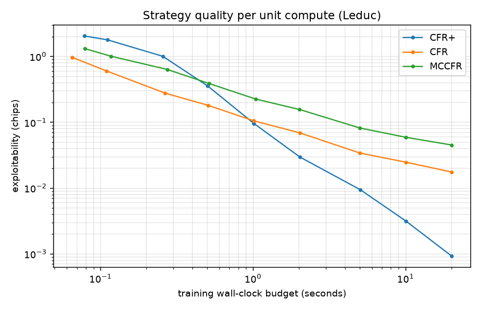
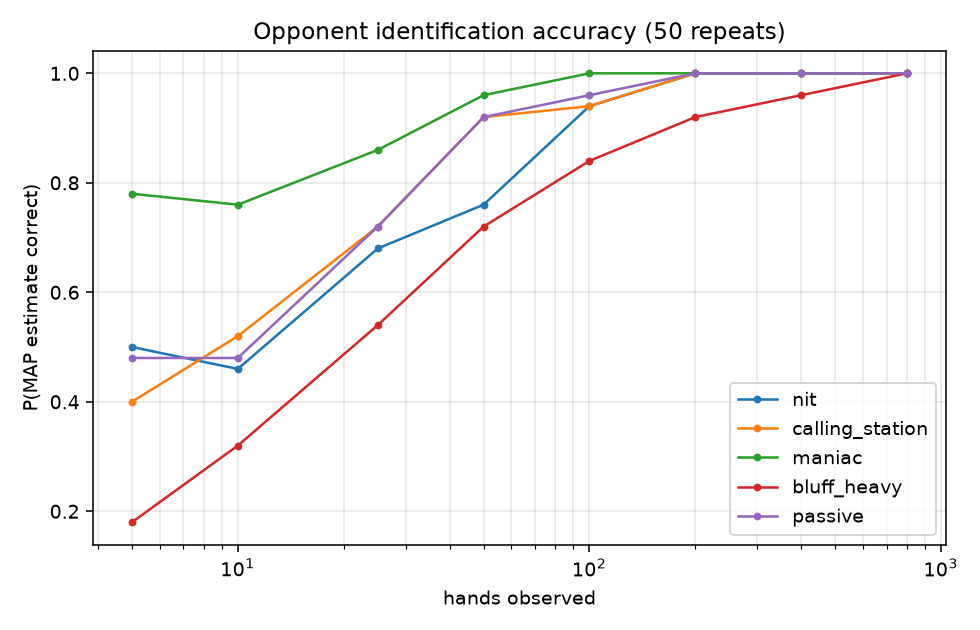
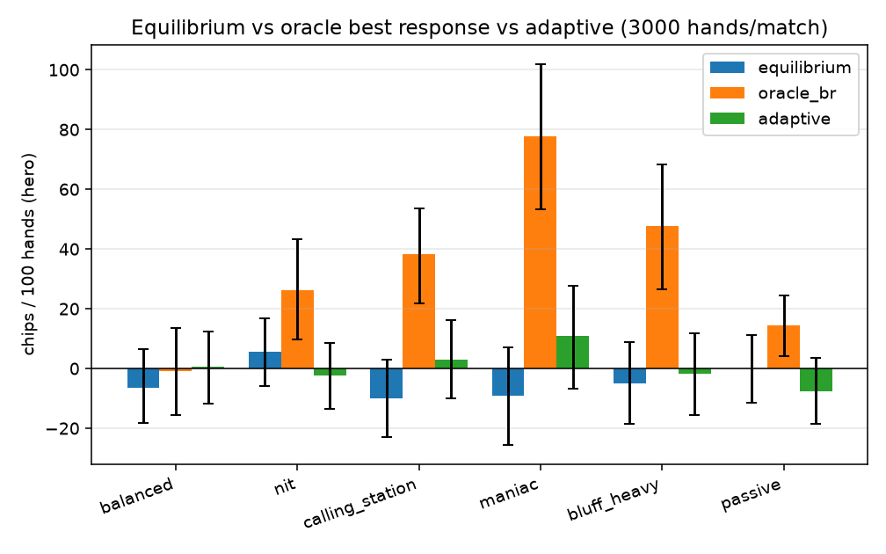
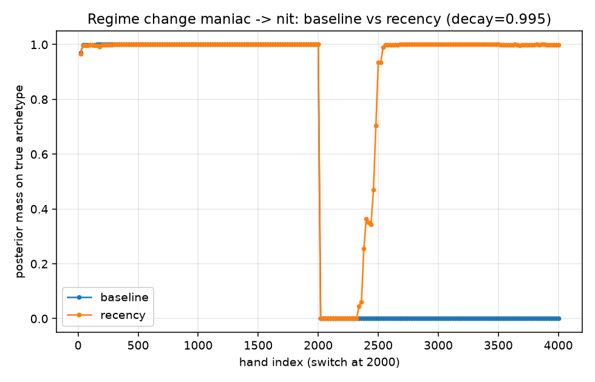
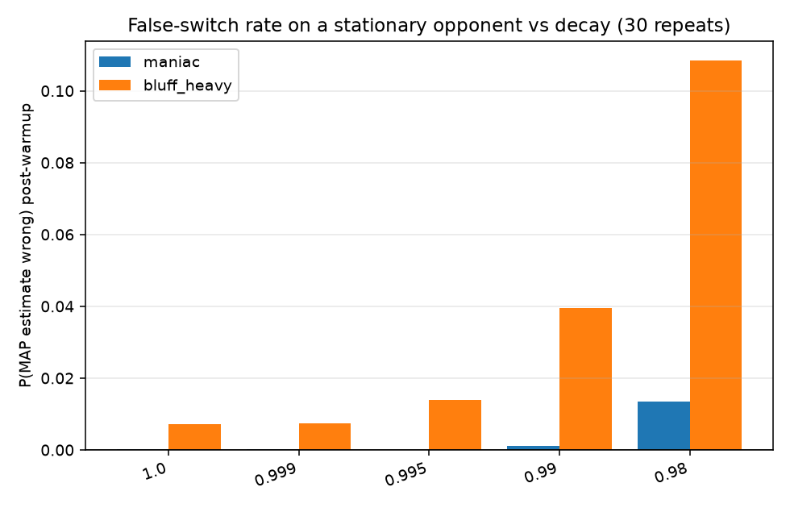
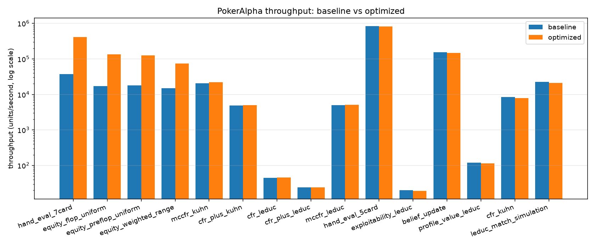
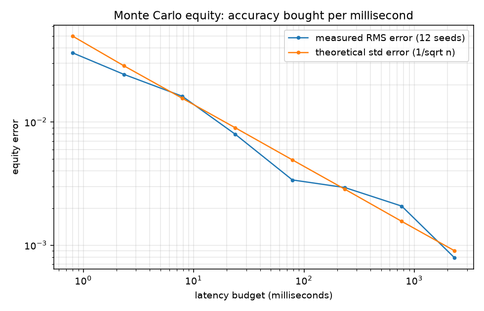

# Adaptive Exploitation in Imperfect-Information Games: Robustness, Opponent Inference, and Compute-Constrained Decision Making

**PokerAlpha — a quantitative research project**

---

## Abstract

An equilibrium strategy in a two-player zero-sum game is a robustness
guarantee: it cannot be beaten in expectation whatever the opponent does. It
is also, against a flawed opponent, a decision to leave money on the table.
This project asks how much of that guarantee should be surrendered to exploit
statistically detected deviations in an opponent's behavior when observations
are finite, behavior can change without warning, and computation is bounded.

We implement Kuhn and Leduc poker as extensive-form games, solve them with
CFR, CFR+, and external-sampling MCCFR, verifying convergence against known
game values (Kuhn −0.055554 vs −1/18; Leduc −0.0855 vs −0.0856), then build
six synthetic archetypes as controlled deviations from equilibrium, a discrete
Bayesian identifier restricted to public actions, and a risk-constrained
adaptive agent that blends equilibrium with a best response under an explicit
exploitability budget.

The findings are mixed by design. **Positive:** identification is fast where
the behavioral footprint is large (the maniac archetype is identified in 96%
of runs within 50 hands, 50 repeats), and exploitation is worth a great deal
in principle — an oracle best response earns +77.8 chips/100 against the
maniac versus −9.0 for equilibrium. Under an exploitability budget of ε = 0.1
chips the realizable adaptive agent captures a positive but much smaller share
(+10.9 chips/100), with its blending weight λ capped by the budget (mean
0.059) far below what its own confidence would permit (0.313).
**Negative, and arguably more informative:** detectability and profitability
are nearly unrelated across our archetypes (deviation correlates with
identification accuracy at 0.88 but with exploitability at 0.28, n = 5);
realized win rates carry bootstrap intervals of roughly ±17 chips/100 at 3,000
hands, so most single-match adaptive-versus-equilibrium differences are *not*
individually significant; and a stationary Bayesian belief **fails outright
under distribution shift** — after an unannounced archetype switch the
posterior stays confidently wrong (>0.99 confidence at 96% of post-switch
checkpoints) with essentially zero mass on the true new type (below 1e-319)
for 2,000 subsequent hands, in all three repeats.

We diagnose this as an implicit stationarity assumption in the log-likelihood
recursion and correct it with exponential forgetting, restoring sustained
recovery in 380–500 hands at decay = 0.995 while raising the false-switch rate
on a *stationary* opponent from 0.71% to 1.39% — and to 10.8% at decay = 0.98.
Finally, profiling attributes 94.6% of Monte Carlo equity runtime to one
combinatorial hand-evaluation step; replacing it with direct histogram
evaluation yields 11.0× on the evaluator and 7.9× on equity throughput with
bit-identical results, converting under a fixed 10 ms budget to roughly 2.8×
tighter error bars. A companion experiment shows the best *algorithm* depends
on the budget: plain CFR beats CFR+ below about 0.5 s, they cross near 1 s,
and CFR+ is 19× better by 20 s.

---

## 1. Research Question and Motivation

> **How much equilibrium robustness should an agent sacrifice to exploit
> statistically detected deviations in an opponent, especially when
> observations are noisy, behavior can change, and computation is limited?**

This question has a recognizable shape for anyone who builds quantitative
decision systems. The mapping is close enough to be useful and worth stating
precisely — along with where it fails.

| Poker construct | Decision-systems analogue |
| --- | --- |
| Nash equilibrium strategy | Robust baseline policy with a worst-case guarantee |
| Opponent behavioral deviation | Exploitable structure in the environment |
| Finite hand observations | Estimation error from a finite sample |
| Deviating toward a best response | Taking model risk to capture that structure |
| Exploitability of your own strategy | Quantified cost of being wrong |
| Opponent switching archetype | Distribution shift / regime change |
| Forgetting factor on evidence | Responsiveness vs estimation stability |
| Wall-clock training budget | Latency-constrained decision making |

The analogy earns its keep in one specific respect: poker supplies a
**ground-truth cost of being wrong**. In a two-player zero-sum game
exploitability is exactly computable — the expected loss against a worst-case
adversary — so "how much robustness did I give up?" has a number rather than
an estimate. Few applied settings offer that, and it lets us study the
robustness/exploitation tradeoff without conflating it with the difficulty of
measuring it.

**Where the analogy breaks down**, and these are not minor caveats:

1. **Two-player zero-sum games have a value; markets do not.** The minimax
   theorem guarantees a strategy whose worst-case payoff is the game value.
   No comparable object exists for financial markets, so "equilibrium as a
   safe baseline" does not transfer.
2. **The opponent here is stationary-by-construction between regimes and does
   not adapt to us.** Our archetypes do not observe our strategy or respond to
   being exploited. Real adversaries do, which turns a one-sided inference
   problem into a game.
3. **No capacity, cost, or market impact.** Our deviations are free to
   express and do not move the environment.
4. **The signal is generated by our own model class.** §4.1 explains why this
   is deliberate; §12 (limitation 5) states what it invalidates.

**This project is not a trading strategy and makes no claim about
profitability in real-money poker or in financial markets.** It is an offline
simulation study. What it aims to demonstrate is method: measuring a
robustness/exploitation tradeoff rather than asserting one, falsifying an
assumption experimentally, and treating compute as a first-class constraint.

---

## 2. Game-Theoretic Foundation

**Extensive-form games and information sets.** A poker hand is a sequential
game with chance nodes (the deal) and hidden information (private cards). All
game states that are indistinguishable to the acting player — same own cards,
same public history — form an **information set** *I*. A strategy σ must
assign the same action distribution to every state in *I*; that constraint is
precisely what "not seeing the opponent's cards" means formally, and it is
what makes an imperfect-information best response nontrivial.

**Counterfactual regret.** For an information set *I* and action *a*, the
counterfactual regret after *T* iterations is

```
R_T(I, a) = Σ_{t=1..T}  π^σt_{-i}(I) · ( v^σt(I, a) − v^σt(I) )
```

where `v^σt(I, a)` is the expected utility of playing *a* at *I* and then
following σt, and `π^σt_{-i}(I)` is the probability that the *other* players
and chance reach *I*. The counterfactual weighting is the key detail: it
prices each regret by how often the rest of the world lets you face that
decision at all.

**Regret matching.** The next strategy plays each action in proportion to its
accumulated positive regret:

```
σ_{T+1}(I, a) = max(R_T(I,a), 0) / Σ_b max(R_T(I,b), 0)
```

falling back to uniform when all regrets are non-positive. This is
`regret_matching(regrets: np.ndarray)` in `poker_alpha/solvers/cfr.py`.

**Why CFR converges.** Regret matching bounds average regret as O(1/√T), and
in a two-player zero-sum game a profile in which neither player has positive
average regret is a Nash equilibrium. The guarantee applies to the
**time-averaged** strategy, not the current iterate (which oscillates), so the
solver accumulates strategy sums and reports the average.

**CFR+** clips cumulative regrets at zero, uses alternating updates, and
weights the average linearly in *t*. One implementation subtlety is worth
recording because we hit it: the clip must apply to an information set's
**total** regret once per iteration, not per visited history. An information
set spans several histories (in Kuhn, "hold the Jack" spans two opponent
cards); clipping between visits biases the update and measurably degraded
CFR+ to CFR's O(1/√T) rate until fixed.

**External-sampling MCCFR** samples chance and opponent actions rather than
enumerating them, making each iteration O(depth) instead of O(tree).

**Exploitability** is our quality metric throughout:

```
exploitability(σ) = ½ · [ BR_value(σ, player 0) + BR_value(σ, player 1) ]
```

the average over seats of what a worst-case best-responder wins. It is zero
exactly at Nash and is measured in chips. Our best response respects
information sets — it does not peek at hidden cards — and is computed by
resolving information sets deepest-first with counterfactual reach weights
(`poker_alpha/solvers/evaluation.py`).

**Environments.** *Kuhn poker* (3 cards, 1 betting round, 12 information sets)
has a known analytic equilibrium. *Leduc poker* (6 cards, public card, 2
betting rounds, raise cap; **3,780 decision nodes, 288 rank-merged information
sets**) is ~75× larger and is where every downstream claim here is measured,
because exploitability and exact expected value remain computable in closed
form.

---

## 3. Solver Experiments

### 3.1 Kuhn: verification against known theory

Training vanilla CFR for 100,000 iterations reproduces the analytic solution:

| quantity | measured | theory |
| --- | --- | --- |
| game value to player 0 | −0.055554 | −1/18 ≈ −0.055556 |
| exploitability @ 100k | 6.33 × 10⁻⁴ chips | → 0 at Nash |
| King facing a bet: call | 100% | 100% (dominant) |
| Jack facing a bet: fold | 100% | 100% (dominant) |
| Queen facing a bet: call | 0.336 | 1/3 |

The solution also reproduces the known structural property that player 1 bets
the Jack with probability α and the King with 3α: measured 0.220 and 0.663
respectively. This is a genuine correctness check, not a curve fit — nothing
in the solver encodes it.

### 3.2 Kuhn and Leduc: comparing solvers

On Kuhn (100k iterations, same machine):

| algorithm | runtime | it/s | final exploitability |
| --- | --- | --- | --- |
| CFR | 27.9 s | 3,587 | 6.3 × 10⁻⁴ |
| CFR+ | 53.6 s | 1,865 | 2.1 × 10⁻⁶ |
| MCCFR | 12.3 s | 8,143 | 2.3 × 10⁻³ |

CFR+ reaches ~300× lower exploitability at ~1.9× the per-iteration cost (an
iteration being two alternating traversals). On Leduc:

| algorithm | iterations | runtime | it/s | final exploitability |
| --- | --- | --- | --- | --- |
| CFR | 1k | 50.7 s | 19.7 | 1.57 × 10⁻² |
| CFR+ | 1k | 92.2 s | 10.8 | 2.47 × 10⁻⁴ |
| MCCFR | 200k | 106.0 s | 1,886 | 2.95 × 10⁻² |

The scaling is instructive. Full-traversal cost tracks tree size: CFR fell
from 3,587 it/s on Kuhn to 19.7 it/s on Leduc (~180× slower per iteration for
a ~75× larger tree), while MCCFR's sampled iterations slowed only ~4×
(8,143 → 1,886). The *relative* cheapness of sampling grew from 2.3× to ~96×.

**An honest negative result:** MCCFR is still the worst choice on Leduc even
at matched wall-clock. Sampling variance dominates on a game a full traversal
can comfortably sweep. Sophistication is not an ordering. MCCFR's advantage is
structural — it applies where full traversal is *infeasible in principle* —
and Leduc is not that game.

### 3.3 Algorithm choice is a function of the compute budget

The preceding tables compare solvers at a fixed *iteration* count, which
quietly assumes iterations are the scarce resource. They usually are not; time
is. `experiments/compute_quality_tradeoff.py` trains each solver in chunks
until a wall-clock budget is exhausted — with the evaluation clock stopped, so
measuring never consumes the budget — and then scores exploitability.

| budget | CFR | CFR+ | MCCFR | best |
| --- | --- | --- | --- | --- |
| 0.05 s | 0.972 | 2.058 | 1.320 | CFR |
| 0.10 s | 0.606 | 1.794 | 1.012 | CFR |
| 0.25 s | 0.279 | 1.011 | 0.637 | CFR (3.6× better than CFR+) |
| 0.50 s | 0.182 | 0.358 | 0.390 | CFR |
| 1.00 s | 0.105 | **0.096** | 0.226 | CFR+ (crossover) |
| 2.00 s | 0.069 | 0.030 | 0.157 | CFR+ |
| 5.00 s | 0.034 | 0.0095 | 0.082 | CFR+ |
| 10.0 s | 0.025 | 0.0032 | 0.059 | CFR+ |
| 20.0 s | 0.0176 | **0.00093** | 0.045 | CFR+ (19× better than CFR) |

*(exploitability in chips; lower is better)*



**Interpretation.** The curves cross. Below roughly half a second plain CFR
delivers strictly better strategies: CFR+ spends two alternating traversals
per iteration, so it buys about half as many, and its regret clipping and
linear averaging need enough iterations before the better asymptotic rate
repays that overhead. At 0.25 s CFR is 3.6× better; past the ~1 s crossover the
asymptotics take over and CFR+'s advantage compounds to 19× by 20 s. MCCFR
trails at every budget tested, consistent with §3.2. The lesson generalizes:
*asymptotically superior algorithms can be the wrong choice under tight
latency budgets*, and only measurement locates the crossover.

---

## 4. Opponent Modeling

### 4.1 Synthetic archetypes as controlled deviations

We construct six opponents by *tilting* the Leduc equilibrium with
multiplicative weights on recognizable action classes — fold, call, raise, and
a separate bluff multiplier applied to raises with weak holdings — then
renormalizing at every information set. A multiplier of 1.0 leaves equilibrium
untouched.

| archetype | fold | raise | call | bluff | TV deviation | exploitability |
| --- | --- | --- | --- | --- | --- | --- |
| balanced | 1.0 | 1.0 | 1.0 | 1.0 | 0.0000 | 0.0023 |
| bluff_heavy | 1.0 | 1.0 | 1.0 | 3.0 | 0.0265 | 0.5001 |
| nit | 1.8 | 0.5 | 1.0 | 0.3 | 0.0668 | 0.3240 |
| passive | 1.0 | 0.3 | 1.5 | 1.0 | 0.0752 | 0.1487 |
| calling_station | 0.25 | 0.7 | 1.6 | 1.0 | 0.0931 | 0.3379 |
| maniac | 0.5 | 2.5 | 1.0 | 2.5 | 0.0937 | 1.0751 |

*(TV deviation = mean total-variation distance from equilibrium per
information set; exploitability in chips)*

Synthetic opponents make the experiment *controlled*: the ground-truth
strategy is known exactly, so both the identifier's estimation error and the
EV of any response are computable rather than themselves estimated. Because
the tilt operates on a real equilibrium, the archetypes stay structurally
sensible — a nit still bets the nuts — while deviating in a parameterized way.
**They are experimental instruments, not a taxonomy of real poker players**;
no claim is made that human opponents fall into these six classes.

### 4.2 Bayesian identification from public actions only

The agent never sees the opponent's private card except at showdown. A hand's
evidence is therefore the opponent's public action sequence, and the
likelihood must marginalize over the private cards they could hold:

```
P(actions | σ) = Σ_r  w(r) · Π_t  σ( a_t | I_t(r) )
```

where `w(r)` is the card-removal-adjusted prior over the opponent's hidden
rank and `I_t(r)` is the information set they would occupy at decision *t*
holding rank *r*. When a hand reaches showdown, the revealed rank replaces the
marginalization. A discrete posterior over the six candidates is maintained in
log space:

```
LL_t(k) = LL_{t-1}(k) + log P(actions_t | σ_k)          [stationary form]
```

Confidence is reported as `1 − H(posterior)/log K`, which is 0 at a uniform
posterior and → 1 as the belief concentrates. The information firewall is
enforced by the match simulator, which hands the learner only what it could
legitimately observe.

### 4.3 Identification speed

Hero plays static equilibrium (so identification is measured without an
exploitation feedback loop); 50 repeats per archetype.

| archetype | 5 hands | 25 | 50 | 100 | 200 | 800 |
| --- | --- | --- | --- | --- | --- | --- |
| maniac | 78% | 86% | 96% | 100% | 100% | 100% |
| calling_station | 40% | 72% | 92% | 94% | 100% | 100% |
| passive | 48% | 72% | 92% | 96% | 100% | 100% |
| nit | 50% | 68% | 76% | 94% | 100% | 100% |
| bluff_heavy | 18% | 54% | 72% | 84% | 92% | 100% |

*(P(MAP estimate correct); a uniform prior over 6 candidates gives 16.7%)*



**Interpretation.** Identification speed tracks the size of the behavioral
footprint, not the size of the opportunity. Across the five non-balanced
archetypes, accuracy at 50 hands correlates with total-variation deviation at
r = 0.88 but with exploitability at only r = 0.28 — and deviation and
exploitability are themselves nearly unrelated (r = 0.22). With n = 5 these are
indicative, not significant, but the mechanism is concrete and visible above:
`bluff_heavy` is the *hardest* archetype to identify (18% at 5 hands, the only
one still below 100% at 400) while being the *second most exploitable* (0.500
chips), because its deviation is concentrated in rare weak-hand betting
spots — a small footprint attached to a large payoff. The uncomfortable
implication for exploitation systems: **the opportunities worth the most are
not the ones that announce themselves.**

---

## 5. Adaptive Exploitation

### 5.1 The pipeline

```
equilibrium strategy  ──┐
                        ├─→ λ-blend ─→ exploitability guardrail ─→ adaptive strategy
observed public actions │
   ↓                    │
Bayesian posterior      │
   ↓                    │
posterior-mixture       │
opponent estimate       │
   ↓                    │
exact best response ────┘
```

The agent best-responds to its posterior-mixture *estimate* of the opponent,
then blends that response with equilibrium:

```
σ_adaptive = (1 − λ) · σ_equilibrium  +  λ · BR(estimate)
```

λ ∈ [0,1] is the **exploitation weight** and the central control variable of
this project: λ = 0 is pure robustness, λ = 1 pure exploitation of the
estimate. It is set in two stages.

**Stage 1 — confidence gating.** λ rises with both belief confidence and the
size of the estimated deviation (mean total-variation distance from
equilibrium):

```
λ = confidence · ( 1 − exp(−s · deviation) ),    s = 4
```

Both factors are necessary: high confidence that the opponent *is* equilibrium
(deviation ≈ 0) must yield λ ≈ 0, and so must a large apparent deviation under
a diffuse posterior. With few observations the posterior stays near uniform,
so "three folds out of four" cannot trigger a large adjustment.

**Stage 2 — exploitability guardrail.** That λ is then capped by bisection at
the largest value whose *blended* strategy has exploitability ≤ ε. On Leduc
this cap is exact, not estimated.

### 5.2 The central tradeoff, measured

3,000-hand matches; adaptive agent refreshes every 20 hands under ε = 0.1.

| opponent | equilibrium | oracle BR | adaptive | oracle expl. | adaptive expl. |
| --- | --- | --- | --- | --- | --- |
| maniac | −9.0 | **+77.8** | +10.9 | 2.42 | ≤0.10 |
| bluff_heavy | −4.9 | +47.6 | −1.7 | 2.60 | ≤0.10 |
| calling_station | −10.1 | +38.2 | +3.1 | 1.82 | ≤0.10 |
| nit | +5.6 | +26.3 | −2.3 | 4.05 | ≤0.10 |
| passive | 0.0 | +14.5 | −7.5 | 2.38 | ≤0.10 |
| balanced | −6.3 | −0.8 | +0.5 | 2.03 | 0.0023 |

*(chips/100 hands; exploitability in chips; equilibrium's own exploitability
is 0.0023)*



**The oracle best response is an upper bound, not an agent.** It receives the
opponent's exact strategy at hand 1 and is uncapped, so it cannot be realized:
it needs information no observer has, and it pays for its edge with
exploitability around 1,000× equilibrium's — against any *other* opponent it
would be a liability. It is included solely to bound what perfect knowledge
would be worth (+77.8 vs −9.0 against the maniac).

**Two qualifications.** The bootstrap intervals are wide — roughly ±17
chips/100 at 3,000 hands. The maniac row, adaptive +10.9 [−6.8, +27.6] against
equilibrium −9.0 [−25.6, +7.2], has overlapping intervals: **this table does
not establish that the adaptive agent beats equilibrium at conventional
significance.** Settling that needs many repeated matches rather than one long
one, and §6 supplies the cleaner evidence by computing exact EV instead of
sampling it. Relatedly, the adaptive agent underperforms equilibrium against
`nit` and `passive` here — what a wide interval around a small true effect
looks like.

### 5.3 What actually binds: the guardrail, not confidence

Sweeping ε against the maniac isolates the control mechanism:

| ε (budget) | mean λ applied | realized chips/100 |
| --- | --- | --- |
| 0 | 0.000 | +16.4 |
| 0.02 | 0.013 | +2.0 |
| 0.05 | 0.032 | +11.2 |
| 0.10 | 0.059 | −5.4 |
| 0.30 | 0.160 | +22.4 |
| 1.00 | 0.309 | +9.1 |

The λ column is clean and monotone, converging toward 0.313 — exactly the
uncapped ceiling `confidence_lambda(1.0, 0.0937)` predicts once the posterior
has saturated. **The mechanism works precisely as designed.** The realized-EV
column, from a single 2,000-hand run per ε, is dominated by per-hand variance
and shows no trend; it should not be read as evidence about ε.

The diagnostic point: at ε = 0.1 the applied λ is 0.059, less than one fifth
of the 0.313 that confidence alone would permit. **The exploitability budget,
not statistical confidence, is the binding constraint** in the headline
adaptation experiment. The agent is being held back by its risk limit, which
is the intended behavior of a risk limit.

---

## 6. Estimation Risk and Overfitting

Acting on a small sample is the characteristic failure mode of any
exploitation system. To isolate it from simulation noise,
`experiments/overfitting_vs_sample_size.py` forms a belief from *n* hands,
freezes the resulting strategy, and scores it by **exact** expected value via
full traversal — so only belief formation is stochastic. 15 repeats per point.

Against the maniac (equilibrium EV 0.003, oracle ceiling 1.075 chips/hand):

| evidence | guarded mean | guarded worst | unguarded mean | unguarded worst |
| --- | --- | --- | --- | --- |
| 5 hands | 0.025 | 0.004 | 0.050 | 0.004 |
| 20 | 0.030 | 0.008 | 0.089 | 0.008 |
| 60 | 0.030 | 0.023 | 0.162 | 0.042 |
| 150 | 0.031 | 0.031 | 0.183 | 0.181 |
| 1000 | 0.031 | 0.031 | 0.184 | 0.184 |

Against the calling station, where small samples actually bite:

| evidence | guarded mean | guarded **worst** | unguarded mean | unguarded **worst** |
| --- | --- | --- | --- | --- |
| 5 hands | 0.010 | 0.002 | 0.012 | 0.002 |
| 20 | 0.007 | **−0.020** | 0.013 | **−0.034** |
| 60 | 0.006 | −0.004 | 0.035 | −0.004 |
| 150+ | 0.004 | 0.004 | 0.039 | 0.039 |

**Three findings.**

1. **The confidence gate does most of the early protective work.** At 5–20
   hands the guarded and unguarded columns are nearly identical: a diffuse
   posterior caps λ before the exploitability budget ever binds. The two
   mechanisms are not redundant — they are active in different regimes.
2. **The guardrail matters *after* confidence saturates.** By 60+ hands the
   columns separate sharply (maniac: 0.031 guarded vs 0.184 unguarded). The
   guardrail gives up most of the available edge for a much smaller
   exploitability footprint. Whether that is the right price depends on how
   much you believe your model — which is why ε is an explicit parameter
   rather than an implicit one.
3. **Small samples can produce genuinely negative EV.** At 20 hands against
   the calling station the worst draw is −0.034 unguarded and −0.020 guarded,
   both worse than simply playing equilibrium.

As model-risk control: confidence gating limits *when* you deviate, the
exploitability budget limits *how far*, and neither removes the possibility of
acting on a bad read. They bound the loss; they do not eliminate it.

---

## 7. Negative Result: Failure Under Distribution Shift

This is the most consequential experiment in the project, and it falsifies an
assumption the earlier phases had built on without stating.

**Setup.** The opponent plays `maniac` for 2,000 hands, then silently switches
to `nit` for 2,000 more. The hero receives no signal that anything changed. 3
repeats, paired on identical hand sequences.

**Result.** The stationary belief locks onto `maniac` early in the first
regime — correctly. After the switch:

* the MAP estimate is **never correct at any post-switch checkpoint**, in any
  of the 3 repeats;
* posterior mass on the true new archetype stays **below 1e-319** for the
  entire remaining 2,000 hands (maximum observed: 1.098 × 10⁻³²⁰) — and at
  **297 of 300** post-switch checkpoints it underflows float64 to exactly
  zero, meaning the log-likelihood gap exceeds the ~745 nats double precision
  can represent;
* confidence remains **above 0.99 at 96% of post-switch checkpoints**, never
  dropping below 0.87.

The belief is not merely wrong. It is *confidently* wrong, and it stays that
way for the full horizon — the worst combination available.



**Why, mathematically.** The recursion

```
LL_t = LL_{t-1} + ll_t
```

is exact Bayesian updating under an explicit assumption: that the parameter
being estimated does not change. Every hand ever observed retains full weight
forever. Once 2,000 hands of maniac evidence have accumulated, the
log-likelihood gap between `maniac` and `nit` exceeds ~745 nats (as the
underflow above demonstrates); post-switch evidence arrives at a few nats per
hand, so closing that gap would take thousands of hands before the posterior
even began to move. It is not slow to react — it is *structurally incapable*
of reacting on any relevant timescale.

The measured cost is real but modest under the guardrail: mean exact EV over
the post-switch regime is −0.0120 chips/hand for the stationary belief versus
+0.0075 for the recency-aware one (§8). The ε = 0.1 budget absorbs most of the
damage from being wrong — which is itself a useful finding about what
guardrails buy — but the inference failure is total.

**We present this as an experimental falsification rather than a footnote.**
The stationarity assumption was never written down; it entered implicitly
through a textbook update rule. The experiment that exposed it was designed to
test the assumption, not to showcase the system.

---

## 8. Recency-Aware Correction, and What It Costs

The fix is a single forgetting factor applied before each update:

```
LL_t = decay · LL_{t-1} + ll_t
```

Expanding the recursion shows that a hand observed *k* updates ago contributes
with weight `decay^k`, giving an **effective memory horizon of roughly
1/(1 − decay) hands** — about 200 hands at decay = 0.995. Setting decay = 1.0
recovers the stationary baseline exactly, so the change is backward compatible
and the baseline remains available as a control. Exponential forgetting was
chosen over a rolling window because it is an O(1) update to the existing
scalar accumulator with no history buffer.

**Paired comparison** (same hand sequences fed to both beliefs):

| | stationary (decay = 1.0) | recency (decay = 0.995) |
| --- | --- | --- |
| sustained recovery after switch | **never**, 3/3 repeats | **380–500 hands**, 3/3 repeats |
| confidence while wrong | >0.99 at 96% of checkpoints; min 0.87 | falls to 0.76, then re-saturates |
| mean post-switch exact EV | −0.0120 chips/hand | +0.0075 chips/hand |
| false-switch rate, stationary maniac | 0.02% | 0.00% |
| false-switch rate, stationary bluff_heavy | 0.71% | 1.39% |

Beyond recovering, the recency belief also produces a **visible confidence
dip** (to 0.76) during the transition — a usable "I am confused" signal that
the stationary belief never emits. A system that can flag its own uncertainty
during a regime change is meaningfully different from one that cannot.

### The cost: adaptivity versus stability

Forgetting old evidence necessarily means less evidence resisting noise. The
stationary control — an opponent that **never changes** — measures the price:

| decay | maniac flip rate | bluff_heavy flip rate | bluff_heavy episodes / 3000 hands |
| --- | --- | --- | --- |
| 1.000 | 0.02% | 0.71% | 0.1 |
| 0.999 | 0.02% | 0.73% | 0.13 |
| 0.995 | 0.00% | 1.39% | 0.67 |
| 0.990 | 0.11% | 3.95% | 2.6 |
| 0.980 | 1.35% | 10.84% | 8.6 |



**Interpretation.** The false-switch rate rises monotonically as memory
shortens, and it rises fastest for `bluff_heavy` — the archetype whose
behavioral footprint is smallest and which is therefore hardest to hold onto
with a short memory. At decay = 0.98 the belief misclassifies a completely
stationary opponent at 10.8% of checkpoints, flipping 8.6 times per
3,000-hand run.

**This is a tradeoff curve, not an optimum.** decay = 0.995 sits at a
defensible point *for this environment* — recovery in ~450 hands for roughly
double the false-switch rate on the hardest archetype — but that choice is
conditional on the switch frequency, the archetype set, and the hand rate of
these experiments. A world with rarer regime changes should forget more slowly;
one with frequent shifts should forget faster and tolerate the noise. Nothing
here identifies a universally optimal decay, and the experiment is not designed
to.

---

## 9. Performance Engineering

Throughput is not the objective; it buys statistical precision under a latency
constraint (§10). The methodology matters as much as the result: **measure,
profile, optimize only what profiling justifies, prove the results unchanged,
re-measure.**

**The existing note was wrong.** Project notes estimated ~7k simulations/second
for the equity engine; measured properly, the baseline was **17.1k sims/s** —
which is why the phase began with measurement rather than code.

**Profiling** with `cProfile` on 20,000 equity simulations put **94.6% of
runtime inside `evaluate_best`**. The cause was algorithmic, not micro:
evaluating seven cards by taking the max over every five-card subset costs
C(7,5) = 21 sub-evaluations, so one simulated hand ran 42 — 840,000 calls for
the workload. Sampling, the component that *looks* expensive, was negligible.
`evaluate_best` now evaluates directly from rank/suit histograms and a 13-bit
rank mask, testing categories in descending order and returning at the first
match; straights exploit the identity that in
`m = r & (r>>1) & (r>>2) & (r>>3) & (r>>4)` the highest set bit is the
straight's low card. 21 evaluations become 1. **Re-profiling** then showed the
mixed-type card normalizer `codes()` had risen to ~24% of runtime, doing 560k
`isinstance` checks on values the sampler already produced as integers; a
pre-validated fast path removed it.

**Measured, back-to-back on the same machine (7 timed repetitions):**

| workload | before | after | speedup |
| --- | --- | --- | --- |
| hand_eval_7card | 37,679 evals/s | 414,955 evals/s | **11.01×** |
| equity_flop_uniform | 17,108 sims/s | 135,370 sims/s | **7.91×** |
| equity_preflop_uniform | 17,874 sims/s | 126,444 sims/s | **7.07×** |
| equity_weighted_range | 15,068 sims/s | 74,764 sims/s | **4.96×** |



**The non-results are what make the measurement credible.** Eleven other
workloads — CFR, CFR+, MCCFR on both games, exploitability, `profile_value`,
belief updates, match simulation, 5-card evaluation — landed between **0.93×
and 1.07×**. None imports the hand evaluator, so they form a **built-in
control group** whose spread *is* this machine's noise floor. The
methodological consequence is direct: **no speedup below roughly 1.1× anywhere
in this table should be believed.** An earlier comparison showed apparent
20–30% "regressions" in these untouched workloads; the machine's load average
was 4.1, and re-running both arms back-to-back removed the artifact entirely.
Reporting that first result would have been wrong.

`equity_weighted_range` gains least (4.96×) because a weighted range spends a
second RNG draw per simulation to select the villain combo; once evaluation is
cheap, that call is a larger share of the remainder. Batching those draws was
deliberately **not** done — it would alter the per-seed random stream and break
the reproducibility contract in §14.

**Correctness was proven, not assumed.** All **2,598,960** distinct five-card
hands agree with the reference implementation exactly, with the resulting
category histogram reproducing the textbook frequencies (40 straight flushes,
624 quads, …, 1,302,540 high-card hands); 300,000 random seven-card and 60,000
six-card hands match the original subset-max implementation with zero
mismatches, as do adversarial constructions. End to end, SHA-256 digests of
hand-value streams, exact `estimate_equity` floats for identical seeds, and
CFR/CFR+ average-strategy digests are **bit-identical** before and after, so
every seeded result in this repository still reproduces. A speedup that
changes results is not a speedup.

A precomputed C(52,7) lookup table would reduce evaluation to one array index
but needs 133,784,560 entries; the histogram evaluator captures most of the
benefit with no preprocessing, and no dependency was added — an 11×
algorithmic win made a JIT unnecessary.

---

## 10. Compute Budget and Decision Quality

The two halves of this project meet here. Monte Carlo equity error falls as

```
standard error  ∝  1 / sqrt(n)
```

so accuracy is bought at *quadratic* cost: halving the error requires four
times the compute. Under a fixed latency budget, throughput therefore converts
directly into statistical precision. Measured RMS error over 12 independent
seeds against a 1,000,000-simulation reference:

| latency | simulations | RMS error | theoretical σ |
| --- | --- | --- | --- |
| 0.8 ms | 100 | 3.64 × 10⁻² | 4.97 × 10⁻² |
| 7.9 ms | 1,000 | 1.62 × 10⁻² | 1.56 × 10⁻² |
| 78 ms | 10,000 | 3.39 × 10⁻³ | 4.93 × 10⁻³ |
| 234 ms | 30,000 | 2.94 × 10⁻³ | 2.85 × 10⁻³ |
| 2.31 s | 300,000 | 7.90 × 10⁻⁴ | 9.01 × 10⁻⁴ |



Measured error tracks the theoretical envelope closely across three decades.
The payoff of §9 can then be stated in the only units that matter for a
decision system: **at a fixed 10 ms budget the old evaluator afforded ~171
simulations and the optimized one ~1,354 — and because error scales as 1/√n,
that is approximately 2.8× tighter error bars for identical latency.**

This is the cleanest link in the project between systems work and statistical
decision quality, and it is deflationary: an 11× engineering win does not
produce an 11× better decision, but a √-discounted one. Quantifying that
discount honestly is the point — as is the solver-side counterpart in §3.3,
where treating budget rather than iteration count as the constraint makes both
*which algorithm* and *how precisely* one can act into empirical questions.

---

## 11. Risk: Why Expected Value Is Not Enough

A strategy with positive expected value can still be ruinous if it is sized
badly, and every strategy in this project carries estimation error on top of
variance. The `risk/` module supplies the standard apparatus: return and
downside metrics, maximum drawdown, VaR/CVaR, percentile bootstrap confidence
intervals, Kelly sizing, and bankroll/risk-of-ruin simulation.

The Kelly criterion makes the core point concretely. For a bet paying *b*:1 at
win probability *p*, the log-growth-optimal fraction is

```
f* = (b·p − q) / b,    q = 1 − p
```

Betting more than f* raises expected *chips* — maximized by staking everything
— while *lowering* long-run growth and raising ruin probability. Simulating
500 bets at p = 0.55, b = 1 (f* = 0.10), 3,000 paths:

| fraction of Kelly | E[log growth] | median final | P(ruin) | median max drawdown |
| --- | --- | --- | --- | --- |
| 0.5× | 0.0038 | 6.53 | 0.000 | 53% |
| 1.0× | 0.0050 | 12.23 | 0.000 | 83% |
| 1.5× | 0.0037 | 6.47 | 0.007 | 96% |
| 2.0× | −0.0001 | 0.93 | 0.113 | 99% |

Doubling Kelly turns a positive-edge bet into a median *loss* with an 11%
chance of practical ruin. Maximizing expected value and maximizing expected
log-wealth are different objectives, and the gap widens precisely when *p* is
uncertain — which, given §6, it always is here. Fractional Kelly is what
practitioners use for exactly that reason.

Two caveats: poker hands are close to i.i.d. and carry no time value, so the
Sharpe-style ratios in the module are signal-to-noise analogies rather than
claims that chips are an asset class; and the bankroll simulator approximates
per-100-hand results as normal, justified by the CLT at that aggregation level
but not for single hands.

---

## 12. Limitations

Stated plainly, because the credibility of everything above depends on them.

**Scale and environment.**
1. Leduc has 288 information sets. No-limit Hold'em has on the order of 10¹⁶⁰
   game states. Every quantitative conclusion here is measured on a game that
   fits in memory, and none should be assumed to survive that gap.
2. The Hold'em implementation (`games/holdem.py`) is a betting-abstracted
   state engine, not a solved game. It is not used for any result in this
   paper.
3. MCCFR's poor showing is **specific to this problem size**. On a game where
   full traversal is infeasible, the ordering would be expected to reverse;
   we did not test that regime.

**Opponent model.**
4. Archetypes are synthetic multiplicative tilts, not empirical player types.
5. The identifier assumes the true opponent is well approximated by a mixture
   of six known candidates. A real opponent outside that class would be
   projected onto the nearest candidate with unquantified error — arguably the
   single largest gap between this study and practice.
6. Opponents do not adapt to the hero. Real adversaries respond to being
   exploited, making the true problem a game rather than an inference task.
7. `decay = 0.995` is environment-specific, conditional on the switch
   frequency and archetype set tested. No universally optimal decay is claimed.

**Statistics.**
8. Realized-EV match results carry bootstrap intervals of roughly ±17
   chips/100 at 3,000 hands. **Most single-match adaptive-versus-equilibrium
   differences in §5.2 are not individually significant.** The exact-EV
   experiments (§6) are the load-bearing evidence.
9. The detectability/exploitability correlations in §4.3 use n = 5 archetypes
   and are indicative only.
10. The ε-sweep's realized-EV column shows no trend and should not be
    interpreted; only its λ column is informative.
11. Regime-change results use 3 repeats. The recovery-window figures
    (380–500 hands) are consistent across them but rest on a small sample.

**Scope.**
12. No rake, commission, or transaction friction appears in any central
    experiment. Rake changes the profitability of marginal actions and would
    shift some conclusions.
13. This is an offline research simulation. There is no real-time system, no
    connection to any poker platform, and no live deployment.
14. **No claim is made about profitability in real-money poker or in financial
    markets.** The trading analogy in §1 is expository, and §1 lists where it
    fails.

---

## 13. Main Findings

1. **Equilibrium is robust but concedes structured EV.** Against the maniac,
   equilibrium earns −9.0 chips/100 while an oracle best response earns +77.8.
   The opportunity cost of pure robustness is large and measurable.

2. **Detectability and exploitability are close to unrelated.** Identification
   speed tracks total-variation deviation (r = 0.88) far more than
   exploitability (r = 0.28, n = 5). `bluff_heavy` is the hardest archetype to
   identify yet the second most profitable to exploit. The best opportunities
   do not announce themselves.

3. **Estimation risk is real, and the two safeguards act in different
   regimes.** Below ~20 hands of evidence the confidence gate does the
   protective work; past ~60 hands the exploitability budget becomes the
   binding constraint (mean λ = 0.059 against a confidence-implied ceiling of
   0.313 at ε = 0.1). Neither eliminates loss: the worst 20-hand draw against
   a calling station is −0.020 chips/hand guarded, −0.034 unguarded.

4. **Stationary Bayesian inference fails outright under regime change.** After
   an unannounced archetype switch, the posterior kept >0.99 confidence at 96%
   of checkpoints while placing below 1e-319 mass on the true type, and never
   recovered across 2,000 hands in 3/3 repeats. The cause is structural: with
   `LL_t = LL_{t-1} + ll_t`, old evidence never decays.

5. **Exponential forgetting restores adaptation at a quantified price.** At
   decay = 0.995, sustained recovery takes 380–500 hands and post-switch EV
   improves from −0.0120 to +0.0075 chips/hand, while the false-switch rate on
   a *stationary* bluff_heavy opponent rises from 0.71% to 1.39% — and to
   10.8% at decay = 0.98. Adaptivity and stability trade off along a measured
   curve with no universal optimum.

6. **The best algorithm depends on the compute budget.** Plain CFR beats CFR+
   below ~0.5 s (3.6× better at 0.25 s), they cross near 1 s, and CFR+ is 19×
   better by 20 s. Asymptotic superiority is not a decision rule under latency
   constraints.

7. **Algorithmic optimization converts into statistical precision at a
   square-root discount.** Profiling found 94.6% of equity runtime in one
   combinatorial step; removing it gave 11.01× on the evaluator and 7.91× on
   flop equity with bit-identical results. Under a fixed 10 ms budget that is
   ~171 → ~1,354 simulations, i.e. ~2.8× tighter error bars — not 7.9×.

---

## 14. Reproducibility

Every number in this document comes from a committed CSV under
`results/data/`, produced by a seeded script in `experiments/`. Nothing is
hand-entered.

**Environment and tests**

```bash
pip install -e ".[dev]"
pytest                        # 168 tests
```

**Foundational solver results** (§3)

```bash
python experiments/kuhn_convergence.py --iterations 100000 --seed 42
python experiments/cfr_comparison.py --iterations 100000 --seed 42
python experiments/leduc_convergence.py --iterations 1000 --seed 42
```

**Opponent modeling and adaptation** (§4–§6)

```bash
python experiments/opponent_identification.py --repeats 50 --seed 42
python experiments/adaptation_vs_archetypes.py --hands 3000 --seed 42
python experiments/overfitting_vs_sample_size.py --repeats 15 --seed 42
```

**Regime change, baseline vs recency-aware** (§7–§8)

```bash
python experiments/regime_change.py --seed 42
```

**Performance and compute budget** (§9–§10)

```bash
python experiments/performance_benchmark.py --label baseline
python experiments/performance_benchmark.py --label optimized
python experiments/performance_benchmark.py --compare baseline optimized
python experiments/compute_quality_tradeoff.py --seed 42
```

**Notes on reproducibility.** All randomness flows through seeded
`numpy.random.Generator` instances. Equity results are bit-reproducible for a
given seed, and the phase-17 optimization deliberately preserved the RNG draw
sequence so that pre- and post-optimization results are identical rather than
merely statistically compatible. Timing results are inherently
machine-dependent: the before/after benchmarks must be run back-to-back on an
idle machine, and the untouched control workloads (§9) should be checked to sit
within ~±7% before any speedup is believed.

**Data map**

| section | data |
| --- | --- |
| §3.1–3.2 | `kuhn_convergence.csv`, `cfr_comparison*.csv`, `leduc_convergence_*.csv` |
| §3.3, §10 | `compute_quality_tradeoff.csv`, `compute_quality_equity.csv` |
| §4.3 | `opponent_identification.csv` |
| §5.2–5.3 | `adaptation_vs_archetypes.csv`, `adaptation_epsilon_sweep.csv` |
| §6 | `overfitting_vs_sample_size.csv` |
| §7–§8 | `regime_change_switching.csv`, `regime_change_switching_ev.csv`, `regime_change_control_summary.csv` |
| §9 | `performance_baseline.csv`, `performance_optimized.csv`, `performance_comparison.csv` |

---

*PokerAlpha is an offline simulation and research project. It does not connect
to, automate, or interact with any real poker platform, and makes no claim
regarding profitability in real-money poker or financial markets.*
